# 03 — Linear Algebra

**Time: ~14 hours** (spread it over 5–6 days) · **You need: [01 Algebra](01-Algebra.md), [02 Functions](02-Functions.md)** · **Code lab: `math/03_linear_algebra.py`**

## Before you start

**Linear algebra** is the math of **lists of numbers** and **grids of numbers**, and of what happens when you combine them. Nearly all data in ML is stored as lists and grids, so this is the language ML is written in.

This is the longest file in the phase. That's on purpose. Take it slowly.

**How to read it:**

- Go **in order**. Each section uses the ones before it.
- **Draw pictures.** For anything in 2 dimensions, sketch it on paper with arrows. Linear algebra is much easier to see than to read.
- When you see a worked example, **cover the solution and try it first**.
- Say each symbol aloud using its "read it aloud as" note.
- Lost on a symbol? Check the [symbol cheat sheet](#symbol-cheat-sheet) at the bottom.
- The **"Why ML cares"** boxes are motivation only.

**What you'll be able to do by the end:**

- Add, scale, measure, and compare vectors, and explain what each operation means as a picture
- Multiply matrices and explain a matrix as a transformation of space
- Explain span, basis, rank, determinant, and inverse, and how they connect
- Find eigenvalues and eigenvectors of a 2×2 matrix, and explain what SVD does

---

## Contents

**Part A — Vectors**

1. [Vectors](#1-vectors)
2. [Adding vectors and multiplying by a number](#2-adding-vectors-and-multiplying-by-a-number)
3. [Length and distance](#3-length-and-distance)
4. [Angles, cosine, and sine: the minimum you need](#4-angles-cosine-and-sine-the-minimum-you-need)
5. [The dot product](#5-the-dot-product)
6. [Cosine similarity](#6-cosine-similarity)
7. [Projection](#7-projection)
8. [Linear combinations, span, independence, and basis](#8-linear-combinations-span-independence-and-basis)

**Part B — Matrices**

9. [Matrices](#9-matrices)
10. [Multiplying a matrix by a vector](#10-multiplying-a-matrix-by-a-vector)
11. [Matrices as transformations](#11-matrices-as-transformations)
12. [Multiplying two matrices](#12-multiplying-two-matrices)
13. [Transpose and symmetric matrices](#13-transpose-and-symmetric-matrices)
14. [The determinant](#14-the-determinant)
15. [The inverse matrix](#15-the-inverse-matrix)
16. [Systems of equations and rank](#16-systems-of-equations-and-rank)
17. [Orthogonality and least squares](#17-orthogonality-and-least-squares)
18. [Eigenvalues and eigenvectors](#18-eigenvalues-and-eigenvectors)
19. [SVD: the big picture](#19-svd-the-big-picture)

[Code lab](#code-lab--math03_linear_algebrapy) · [Check yourself](#check-yourself)

---

# Part A — Vectors

## 1. Vectors

### The problem

One number isn't enough to describe most things.

- A location on a map needs **two** numbers: how far east, how far north.
- A house might be described by **three**: floor area, number of rooms, age.
- A hand position might need **63**: the x, y, z position of each of 21 points on the hand.

We need a single object that holds several numbers together, in a fixed order.

### Definition

A **vector** is an ordered list of numbers:

$$
\mathbf{v} = [3, 1]
$$

- The numbers inside are called **components** (or entries).
- **Order matters:** $[3, 1]$ and $[1, 3]$ are different vectors.
- The **dimension** of a vector is how many components it has. $[3, 1]$ is 2-dimensional, and $[4, 0, -2]$ is 3-dimensional.

### Notation

- Vectors are written in **bold lowercase**: $\mathbf{v}$, $\mathbf{a}$, $\mathbf{x}$. Read $\mathbf{v}$ aloud as "vector v" or just "v." (By hand, people draw a small arrow on top: $\vec{v}$.)
- Plain letters like $x$ are single numbers. These are called **scalars**, to distinguish them from vectors.
- Components use **subscripts** (Algebra §5): for $\mathbf{v} = [3, 1]$, $v_1 = 3$ and $v_2 = 1$. Notice the component is not bold, because it's a single number.

**Written as a column.** In math books, vectors are often written vertically:

$$
\mathbf{v} = \begin{bmatrix} 3 \\ 1 \end{bmatrix}
$$

It's the same vector, just displayed in a column. For now, treat row and column writing as the same thing. (§13 explains when the difference matters.)

### $\mathbb{R}^n$: the set of all vectors of a given size

Recall $\mathbb{R}$ means "all real numbers" (Functions §2).

$\mathbb{R}^2$ (read aloud as "**R two**") means **all vectors with 2 real-number components**. $\mathbb{R}^3$ is all vectors with 3 components, and $\mathbb{R}^n$ is all vectors with $n$ components.

So $\mathbf{v} \in \mathbb{R}^2$ is read "v is in R two" and means "$\mathbf{v}$ is a list of 2 numbers."

### Two ways to picture a vector

**Picture 1: a point.** $[3, 1]$ is the point 3 right and 1 up (Algebra §6).

**Picture 2: an arrow.** $[3, 1]$ is an arrow **starting at the origin** $(0, 0)$ and ending at the point $(3, 1)$. It's an instruction: "move 3 right and 1 up."

The arrow picture is the one that makes most of this file make sense. You can also slide an arrow anywhere on the page. It's still the same vector, as long as it keeps the same direction and length.

We can draw 2D and 3D vectors. A 63-dimensional vector can't be drawn, but **all the rules are the same**. Build your intuition in 2D, then trust the math for bigger sizes.

### The zero vector

$\mathbf{0} = [0, 0]$ (bold zero) is the vector of all zeros. As an arrow, it has no length and goes nowhere.

> **Why ML cares:** In ML, each data example is a vector. One house = one vector of its features. One frame of hand landmarks = one vector of 63 numbers. In Python (NumPy), a vector is a 1-D array, and its shape is written `(63,)`.

### Exercises

**1.1.** For $\mathbf{u} = [5, -2, 7]$: what's the dimension? What's $u_2$?

**1.2.** Draw the vectors $[2, 3]$, $[-1, 2]$, and $[0, -3]$ as arrows from the origin.

**1.3.** Is $[1, 2] = [2, 1]$? Why or why not?

**1.4.** A student is described by (age, height in cm, weight in kg). Write a vector for a 20-year-old, 165 cm, 58 kg student. Which $\mathbb{R}^n$ is it in?

<details>
<summary>Solutions</summary>

**1.1.** Dimension 3. $u_2 = -2$.

**1.3.** No. Order matters: the first means "1 right, 2 up," and the second means "2 right, 1 up."

**1.4.** $[20, 165, 58] \in \mathbb{R}^3$.

</details>

---

## 2. Adding vectors and multiplying by a number

### Adding vectors

Add **component by component**: first with first, second with second.

$$
[3, 1] + [1, 2] = [3 + 1,\ 1 + 2] = [4, 3]
$$

Both vectors must have the **same dimension**. You can't add $[1, 2]$ and $[1, 2, 3]$.

**The picture: tip to tail.** Walk along the first arrow (3 right, 1 up). From where you end up, walk along the second arrow (1 right, 2 up). Where you finish is the sum: 4 right, 3 up.

The order doesn't matter: $[1, 2] + [3, 1]$ gets you to the same place.

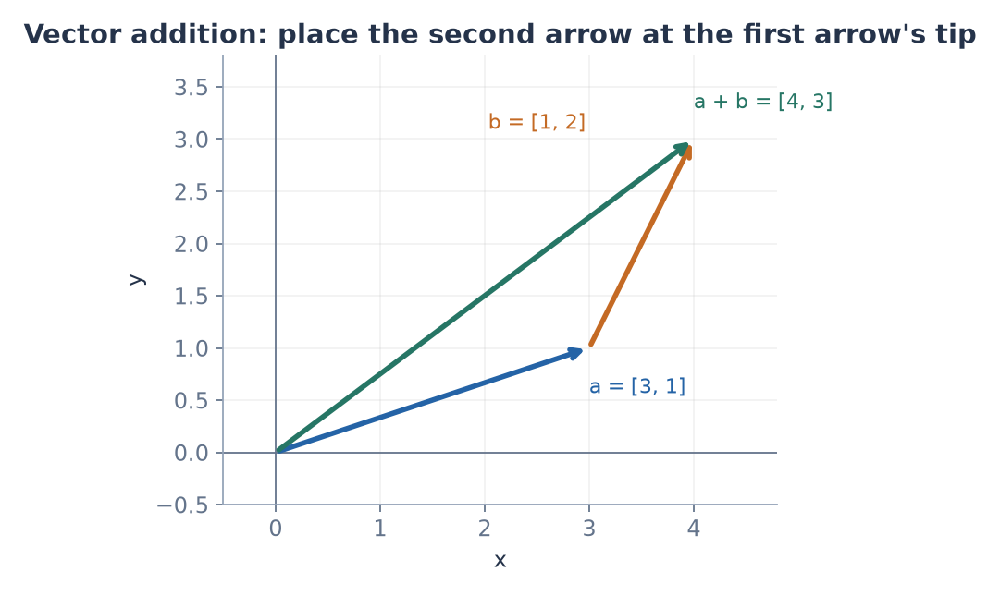

*Follow the blue arrow, then the orange arrow. The green arrow reaches the same endpoint in one move; this is the worked example above.*

### Multiplying a vector by a number

Multiply **every component** by the number:

$$
3 \cdot [2, 1] = [6, 3]
$$

A single number used this way is called a **scalar** (because it "scales" the vector), and this operation is called **scalar multiplication**.

**The picture:**

| Scalar | Effect on the arrow | Example with $[2, 1]$ |
|---|---|---|
| bigger than 1 | stretches it, same direction | $2 \cdot [2, 1] = [4, 2]$ |
| between 0 and 1 | shrinks it, same direction | $0.5 \cdot [2, 1] = [1, 0.5]$ |
| 0 | shrinks it to nothing | $0 \cdot [2, 1] = [0, 0]$ |
| negative | **flips** it to point the opposite way | $-1 \cdot [2, 1] = [-2, -1]$ |

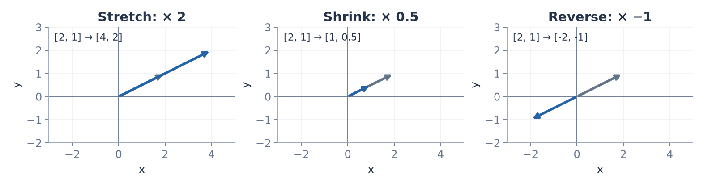

*Gray is the original arrow. Scaling changes every component together: a positive factor keeps its direction, and a negative factor reverses it.*

### Subtracting vectors

$\mathbf{a} - \mathbf{b}$ means $\mathbf{a} + (-1)\mathbf{b}$. Component by component:

$$
[4, 3] - [1, 2] = [3, 1]
$$

**The picture:** $\mathbf{a} - \mathbf{b}$ is the arrow that goes **from the tip of $\mathbf{b}$ to the tip of $\mathbf{a}$**. Check: starting at $(1, 2)$ and moving $[3, 1]$ lands at $(4, 3)$ ✓

This picture is important. It's how we'll measure the distance between two points in §3.

> **Why ML cares:** When a model learns, it repeatedly updates its list of adjustable numbers by taking a small scaled step: new = old − (small number) × (direction). That's exactly scalar multiplication plus vector subtraction.

### Exercises

**2.1.** Calculate $[2, -1, 4] + [3, 3, -2]$.

**2.2.** Calculate $-2 \cdot [1.5, -3]$.

**2.3.** Calculate $[0.5, -1] - 0.1 \cdot [2, -4]$.

**2.4.** Draw $\mathbf{a} = [1, 3]$ and $\mathbf{b} = [4, 1]$. Draw $\mathbf{a} + \mathbf{b}$ tip-to-tail, and $\mathbf{a} - \mathbf{b}$ as the arrow from $\mathbf{b}$'s tip to $\mathbf{a}$'s tip.

<details>
<summary>Hint</summary>

2.3: do the scalar multiplication first (like order of operations), then subtract.

</details>

<details>
<summary>Solutions</summary>

**2.1.** $[5, 2, 2]$.

**2.2.** $[-3, 6]$.

**2.3.** $0.1 \cdot [2, -4] = [0.2, -0.4]$, so $[0.5 - 0.2,\ -1 - (-0.4)] = [0.3, -0.6]$.

**2.4.** $\mathbf{a} + \mathbf{b} = [5, 4]$. $\mathbf{a} - \mathbf{b} = [-3, 2]$: from $(4, 1)$, go 3 left and 2 up to reach $(1, 3)$.

</details>

---

## 3. Length and distance

### The problem

How **long** is the arrow $[3, 4]$? How **far apart** are two points? We need a way to measure.

### Length in 2D: Pythagoras

The arrow $[3, 4]$ goes 3 right and 4 up. Those two moves make the two short sides of a right triangle, and the arrow is the long side (Algebra §6):

$$
\text{length} = \sqrt{3^2 + 4^2} = \sqrt{9 + 16} = \sqrt{25} = 5
$$

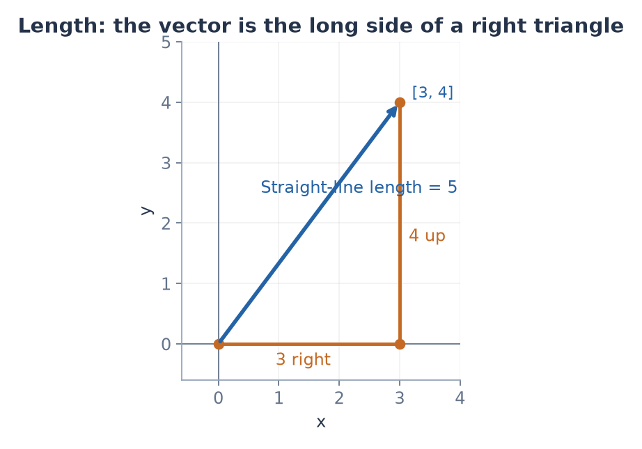

*The horizontal and vertical moves form a right triangle. The arrow's length is the square root of 3² + 4², rather than the total distance along the two sides.*

### Length in any dimension

In 3D, you do Pythagoras twice, and the result is the same pattern: **square each component, add them, take the square root.**

$$
\lVert [1, 2, 2] \rVert = \sqrt{1^2 + 2^2 + 2^2} = \sqrt{9} = 3
$$

The general formula, for $\mathbf{v} \in \mathbb{R}^n$:

$$
\lVert \mathbf{v} \rVert = \sqrt{v_1^2 + v_2^2 + \cdots + v_n^2} = \sqrt{\sum_{i=1}^{n} v_i^2}
$$

- The double bars $\lVert \mathbf{v} \rVert$ are read aloud as "**the length of v**" or "**the norm of v**." ("Norm" is the formal word for length.)
- The $\cdots$ means "continue the pattern."
- Don't confuse double bars with the single bars of absolute value (Functions §8). They're related, though: for a 1-component vector, $\lVert [-5] \rVert = \sqrt{25} = 5 = |{-5}|$.

### Distance between two points

From §2, $\mathbf{a} - \mathbf{b}$ is the arrow from $\mathbf{b}$ to $\mathbf{a}$. So the distance between them is **the length of that arrow**:

$$
\text{distance}(\mathbf{a}, \mathbf{b}) = \lVert \mathbf{a} - \mathbf{b} \rVert
$$

**Example.** Distance between $[1, 2, 3]$ and $[4, 5, 6]$:

| Step | What we did |
|---|---|
| $[1, 2, 3] - [4, 5, 6] = [-3, -3, -3]$ | The arrow between them |
| $\sqrt{(-3)^2 + (-3)^2 + (-3)^2}$ | Its length |
| $= \sqrt{27} \approx 5.196$ | |

### Unit vectors: length exactly 1

Sometimes we only care about **direction**, not length. A vector of length 1 is called a **unit vector**.

To turn any (nonzero) vector into a unit vector pointing the same way, divide it by its own length. This is called **normalizing**:

$$
\hat{\mathbf{v}} = \frac{\mathbf{v}}{\lVert \mathbf{v} \rVert}
$$

(The hat on $\hat{\mathbf{v}}$ is read "v hat." Here it means "the unit version of v." Unfortunately, hats get reused for different meanings in different places.)

**Example.** $\mathbf{v} = [3, 4]$ has length 5, so $\hat{\mathbf{v}} = [0.6, 0.8]$. Check: $\sqrt{0.36 + 0.64} = 1$ ✓

### Another way to measure length (L1) — *Good to know*

The length above is the "straight-line" or **Euclidean** length. It's also called the **L2 norm**, written $\lVert \mathbf{v} \rVert_2$.

Another way is to add up the absolute values: how far you'd walk if you could only move along grid streets, like a taxi in a city. This is the **L1 norm**:

$$
\lVert \mathbf{v} \rVert_1 = |v_1| + |v_2| + \cdots + |v_n|
$$

For $[3, -4]$: L2 length is 5, and L1 length is $3 + 4 = 7$.

When people just write $\lVert \mathbf{v} \rVert$ with no subscript, they mean L2.

> **Why ML cares:** "How similar are these two data points?" is often answered by their distance. Two similar hand poses have a small distance between their 63-number vectors.

### Exercises

**3.1.** Find $\lVert [6, 8] \rVert$ and $\lVert [2, -1, 2] \rVert$.

**3.2.** Find the distance between $[0, 0, 0]$ and $[1, 1, 1]$.

**3.3.** Normalize $[5, 12]$. Check that the result has length 1.

**3.4.** For $\mathbf{v} = [1, -2, 2]$, find the L2 length and the L1 length.

**3.5.** In 2D, sketch all the points whose L2 length is exactly 1. Then sketch all the points whose L1 length is exactly 1. (You'll use this picture again much later.)

<details>
<summary>Hint</summary>

3.5: for L1, try the points $[1, 0]$, $[0.5, 0.5]$, and $[0, 1]$. What shape do they make?

</details>

<details>
<summary>Solutions</summary>

**3.1.** $10$. $\sqrt{4 + 1 + 4} = 3$.

**3.2.** $\sqrt{3} \approx 1.732$.

**3.3.** Length 13, so $[\frac{5}{13}, \frac{12}{13}]$. Check: $\frac{25 + 144}{169} = 1$ ✓

**3.4.** L2: $\sqrt{1 + 4 + 4} = 3$. L1: $1 + 2 + 2 = 5$.

**3.5.** L2: a circle of radius 1. L1: a diamond (a square turned 45°) with corners at $(1, 0)$, $(0, 1)$, $(-1, 0)$, $(0, -1)$.

</details>

---

## 4. Angles, cosine, and sine: the minimum you need

### The problem

Next we'll want to measure **how much two vectors point in the same direction**. That's about the **angle** between them. So you need a small amount of trigonometry. Only what's used later is here.

### Angles

Angles measure **how much you turn**, in **degrees** ($°$):

| Angle | Turn |
|---|---|
| $0°$ | no turn (same direction) |
| $90°$ | a quarter turn (a square corner) |
| $180°$ | a half turn (opposite direction) |
| $360°$ | a full turn (back to the start) |

Angles are often named with the Greek letter $\theta$, read aloud as "**theta**."

### Cosine and sine from a right triangle

Take a right triangle, and pick one of its non-square corners with angle $\theta$.

- The **hypotenuse** is the long side, across from the square corner.
- The **adjacent** side is the short side touching angle $\theta$.
- The **opposite** side is the short side across from $\theta$.

$$
\cos\theta = \frac{\text{adjacent}}{\text{hypotenuse}}, \qquad \sin\theta = \frac{\text{opposite}}{\text{hypotenuse}}
$$

Read aloud as "**cosine** of theta" and "**sine** of theta." Both are **functions** (Functions §1): an angle goes in, a number comes out.

### The picture that matters: a point on a circle

Draw a circle of radius 1 around the origin. Start at $[1, 0]$ and turn counterclockwise by angle $\theta$. The point where you land is:

$$
[\cos\theta,\ \sin\theta]
$$

**Why:** the triangle from the origin to that point has hypotenuse 1 (the radius), so $\cos\theta = \frac{\text{adjacent}}{1}$ is exactly the horizontal distance, and $\sin\theta$ is exactly the vertical distance.

So:

- $\cos\theta$ = **how far right** (negative means left) you are after turning $\theta$
- $\sin\theta$ = **how far up** (negative means down) you are after turning $\theta$

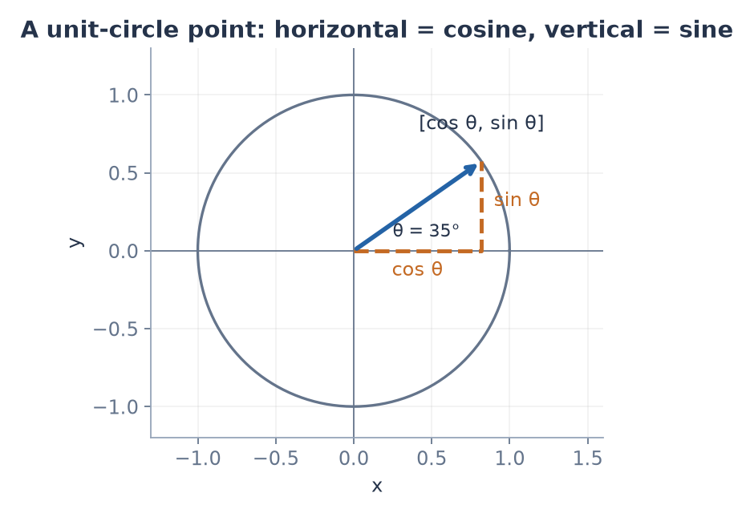

*Demonstration at 35°: the radius has length 1. Dropping straight down from its tip separates the horizontal cosine component from the vertical sine component.*

### The values to know

Read them straight off the circle:

| $\theta$ | $0°$ | $45°$ | $60°$ | $90°$ | $120°$ | $180°$ |
|---|---|---|---|---|---|---|
| $\cos\theta$ | $1$ | $0.707$ | $0.5$ | $0$ | $-0.5$ | $-1$ |
| $\sin\theta$ | $0$ | $0.707$ | $0.866$ | $1$ | $0.866$ | $0$ |

**The key intuition about cosine:**

- $\cos\theta = 1$: pointing the **same** way
- $\cos\theta = 0$: at a **right angle** (neither same nor opposite)
- $\cos\theta = -1$: pointing **opposite** ways
- In between: partly same or partly opposite

Cosine is a "how much in the same direction" score from $-1$ to $1$. That's exactly what we'll use it for.

### One identity

Because the point $[\cos\theta, \sin\theta]$ is on a circle of radius 1, Pythagoras gives:

$$
\cos^2\theta + \sin^2\theta = 1
$$

($\cos^2\theta$ means $(\cos\theta)^2$.) Check at $45°$: $0.707^2 + 0.707^2 = 0.5 + 0.5 = 1$ ✓

### Degrees vs. radians (for code)

Math libraries measure angles in **radians** instead of degrees. The conversion is: $180° = \pi$ radians (where $\pi \approx 3.14159$). So $90° = \frac{\pi}{2}$, and in Python `np.cos(np.pi / 2)` is (almost exactly) 0. Use `np.radians(90)` to convert.

### Exercises

**4.1.** You face $[1, 0]$ and turn $90°$ counterclockwise. What point on the radius-1 circle are you at? Check with the table.

**4.2.** Without the table: what's $\cos(180°)$? Explain using the circle.

**4.3.** Verify $\cos^2\theta + \sin^2\theta = 1$ at $60°$.

**4.4.** Two arrows point at a $120°$ angle to each other. Are they more "same direction" or more "opposite direction"?

<details>
<summary>Solutions</summary>

**4.1.** $[0, 1]$, which matches $\cos 90° = 0$, $\sin 90° = 1$.

**4.2.** Turning halfway around lands you at $[-1, 0]$, so the horizontal position is $-1$.

**4.3.** $0.25 + 0.866^2 \approx 0.25 + 0.75 = 1$ ✓

**4.4.** More opposite: $\cos 120° = -0.5$ is negative.

</details>

---

## 5. The dot product

### The problem

We want **one number** that says how much two vectors point in the same direction, combined with how long they are.

### The calculation

Multiply matching components, then add everything up:

$$
\mathbf{a} \cdot \mathbf{b} = a_1 b_1 + a_2 b_2 + \cdots + a_n b_n = \sum_{i=1}^{n} a_i b_i
$$

Read $\mathbf{a} \cdot \mathbf{b}$ aloud as "**a dot b**." The result is a **single number**, not a vector.

**Example.** $[1, 2, 3] \cdot [4, 5, 6]$

| $i$ | $a_i$ | $b_i$ | $a_i b_i$ |
|---|---|---|---|
| 1 | 1 | 4 | 4 |
| 2 | 2 | 5 | 10 |
| 3 | 3 | 6 | 18 |
| **Sum** | | | **32** |

### Meaning 1: a weighted total

You buy 2 kg of rice at ₱10/kg, 3 eggs at ₱5 each, and 1 bottle of oil at ₱20:

$$
\text{quantities} \cdot \text{prices} = [2, 3, 1] \cdot [10, 5, 20] = 20 + 15 + 20 = 55
$$

**The dot product is "multiply each amount by its weight, then add it all up."** Keep this meaning in mind. It's everywhere.

### Meaning 2: the geometry

The dot product also equals:

$$
\mathbf{a} \cdot \mathbf{b} = \lVert \mathbf{a} \rVert \, \lVert \mathbf{b} \rVert \cos\theta
$$

where $\theta$ is the angle between the two arrows.

**Check with numbers:** $\mathbf{a} = [1, 0]$ and $\mathbf{b} = [1, 1]$. The angle between them is $45°$.

- Calculation: $1 \cdot 1 + 0 \cdot 1 = 1$
- Geometry: $\lVert \mathbf{a} \rVert = 1$, $\lVert \mathbf{b} \rVert = \sqrt{2} \approx 1.414$, $\cos 45° \approx 0.707$. So $1 \times 1.414 \times 0.707 \approx 1.0$ ✓

### Why the calculation and the geometry agree

**Step 1: an easy case.** Suppose $\mathbf{a}$ lies flat along the x-axis: $\mathbf{a} = [\lVert \mathbf{a} \rVert, 0]$. From §4, a vector of length $\lVert \mathbf{b} \rVert$ at angle $\theta$ from the x-axis is $\mathbf{b} = [\lVert \mathbf{b} \rVert\cos\theta,\ \lVert \mathbf{b} \rVert\sin\theta]$. Then:

$$
\mathbf{a} \cdot \mathbf{b} = \lVert \mathbf{a} \rVert \cdot \lVert \mathbf{b} \rVert\cos\theta + 0 \cdot \lVert \mathbf{b} \rVert\sin\theta = \lVert \mathbf{a} \rVert\,\lVert \mathbf{b} \rVert\cos\theta \ ✓
$$

**Step 2: every other case.** Rotating **both** arrows together by the same amount doesn't change their lengths or the angle between them. It doesn't change the dot product either. Check: $[1, 0] \cdot [1, 1] = 1$. Rotate both by $90°$ to get $[0, 1]$ and $[-1, 1]$. Their dot product is $0 \cdot (-1) + 1 \cdot 1 = 1$ ✓. So any pair of arrows can be rotated until $\mathbf{a}$ lies on the x-axis, which is Step 1.

### What the sign tells you

Lengths are never negative, so the **sign** of the dot product comes entirely from $\cos\theta$:

| $\mathbf{a} \cdot \mathbf{b}$ | Angle | Meaning |
|---|---|---|
| positive | less than $90°$ | point roughly the same way |
| **zero** | exactly $90°$ | **perpendicular** |
| negative | more than $90°$ | point roughly opposite ways |

Vectors with dot product zero are called **orthogonal** (the formal word for perpendicular).

**Example.** $[3, 4] \cdot [4, -3] = 12 - 12 = 0$. They're perpendicular.

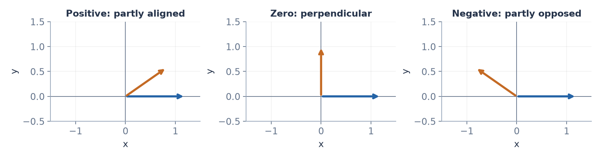

*The sign of the dot product reflects the angle between the arrows. Their lengths also affect its size.*

### A vector dotted with itself

$$
\mathbf{v} \cdot \mathbf{v} = v_1^2 + v_2^2 + \cdots = \lVert \mathbf{v} \rVert^2
$$

The dot product of a vector with itself is its **length squared**. (The angle is $0°$ and $\cos 0° = 1$, so the geometry agrees.)

### The dot product follows familiar rules

It behaves like ordinary multiplication:

- $\mathbf{a} \cdot \mathbf{b} = \mathbf{b} \cdot \mathbf{a}$
- $\mathbf{a} \cdot (\mathbf{b} + \mathbf{c}) = \mathbf{a} \cdot \mathbf{b} + \mathbf{a} \cdot \mathbf{c}$
- $(k\mathbf{a}) \cdot \mathbf{b} = k(\mathbf{a} \cdot \mathbf{b})$

So you can expand brackets like in Algebra. **Example:**

$$
(\mathbf{a} - \mathbf{b}) \cdot (\mathbf{a} - \mathbf{b}) = \mathbf{a} \cdot \mathbf{a} - 2\,\mathbf{a} \cdot \mathbf{b} + \mathbf{b} \cdot \mathbf{b}
$$

Check with $\mathbf{a} = [1, 2]$, $\mathbf{b} = [3, 1]$: the left side is $[-2, 1] \cdot [-2, 1] = 5$. The right side is $5 - 2(5) + 10 = 5$ ✓

> **Why ML cares:** The basic unit of a neural network (a **neuron**) computes a dot product: its inputs times its weights, added up. It's the same as the shopping total. When two data vectors have a big dot product, they're similar in direction, and that's the idea behind search and recommendation systems.

### Exercises

**5.1.** Calculate $[2, -1, 3] \cdot [1, 4, 2]$.

**5.2.** Find a nonzero vector perpendicular to $[2, 5]$.

**5.3.** Use the geometric formula to find the angle between $[1, 0]$ and $[0, 3]$. Then check with the calculation.

**5.4.** Without calculating the angle: do $[1, 2]$ and $[-3, 1]$ point roughly the same way, perpendicular, or roughly opposite?

**5.5.** Expand $(\mathbf{a} + \mathbf{b}) \cdot (\mathbf{a} + \mathbf{b})$ using the rules. Check it with $\mathbf{a} = [1, 0]$, $\mathbf{b} = [0, 1]$.

<details>
<summary>Hint</summary>

5.2: try swapping the two numbers and making one of them negative.
5.4: compute the dot product and look only at its sign.

</details>

<details>
<summary>Solutions</summary>

**5.1.** $2 - 4 + 6 = 4$.

**5.2.** $[5, -2]$ (or any multiple). Check: $10 - 10 = 0$.

**5.3.** The calculation gives $0$. So $\cos\theta = 0$, meaning $\theta = 90°$.

**5.4.** $-3 + 2 = -1$. Negative, so roughly opposite (a bit more than $90°$).

**5.5.** $\mathbf{a} \cdot \mathbf{a} + 2\,\mathbf{a} \cdot \mathbf{b} + \mathbf{b} \cdot \mathbf{b}$. Check: left side $[1, 1] \cdot [1, 1] = 2$. Right side $1 + 0 + 1 = 2$ ✓

</details>

---

## 6. Cosine similarity

### The problem

The dot product mixes two things together: **direction** and **length**. Often we want direction only. For example, a short text and a long text about the same topic should count as "similar," even though one vector is much longer.

### Remove the lengths

Rearrange the geometric formula from §5 to get $\cos\theta$ by itself:

$$
\cos\theta = \frac{\mathbf{a} \cdot \mathbf{b}}{\lVert \mathbf{a} \rVert\,\lVert \mathbf{b} \rVert}
$$

This is called **cosine similarity**. It's always between $-1$ and $1$ (§4):

- $1$ = exactly the same direction
- $0$ = perpendicular (unrelated)
- $-1$ = exactly opposite

**Example.** $\mathbf{a} = [1, 2, 3]$ and $\mathbf{b} = [4, 5, 6]$.

| Step | Value |
|---|---|
| $\mathbf{a} \cdot \mathbf{b}$ | $32$ (from §5) |
| $\lVert \mathbf{a} \rVert$ | $\sqrt{1 + 4 + 9} = \sqrt{14} \approx 3.742$ |
| $\lVert \mathbf{b} \rVert$ | $\sqrt{16 + 25 + 36} = \sqrt{77} \approx 8.775$ |
| $\cos\theta$ | $\frac{32}{3.742 \times 8.775} \approx \frac{32}{32.833} \approx 0.975$ |

Very close to 1, so these point in almost the same direction.

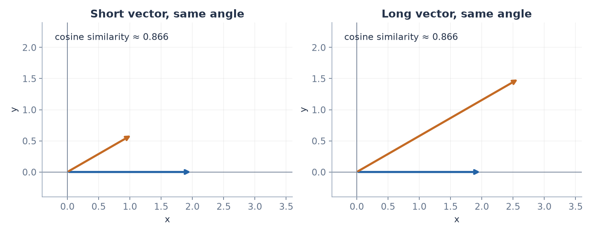

*Separate demonstration: changing the orange arrow's length changes its dot product with the blue arrow, but the 30° angle and cosine similarity stay the same.*

### Dot product vs. cosine similarity: they can disagree

Take a "query" $\mathbf{q} = [1, 1]$ and two candidates, $\mathbf{b} = [10, 8]$ and $\mathbf{c} = [2, 2]$.

| | Dot product with $\mathbf{q}$ | Cosine similarity with $\mathbf{q}$ |
|---|---|---|
| $\mathbf{b} = [10, 8]$ | $18$ ← winner | $\frac{18}{1.414 \times 12.806} \approx 0.994$ |
| $\mathbf{c} = [2, 2]$ | $4$ | $\frac{4}{1.414 \times 2.828} = 1.0$ ← winner |

$\mathbf{c}$ points **exactly** the same way as $\mathbf{q}$, but $\mathbf{b}$ is **longer**. The dot product rewards length. Cosine similarity ignores it.

### For unit vectors, all three measures agree

If both vectors have length 1, the bottom of the cosine formula is $1 \times 1 = 1$, so:

$$
\cos\theta = \mathbf{a} \cdot \mathbf{b}
$$

And expanding distance squared using §5's rules:

$$
\lVert \mathbf{a} - \mathbf{b} \rVert^2 = \mathbf{a} \cdot \mathbf{a} - 2\,\mathbf{a} \cdot \mathbf{b} + \mathbf{b} \cdot \mathbf{b} = 1 - 2\cos\theta + 1 = 2 - 2\cos\theta
$$

So for unit vectors: **bigger cosine ⟺ bigger dot product ⟺ smaller distance**. All three rank things in the same order. (The symbol $⟺$ means "exactly when" or "if and only if.")

> **Why ML cares:** Search systems (like the retrieval part of DPWH Watchdog) turn text into vectors, then find the stored vectors most similar to a question's vector. Whether they use cosine similarity, dot product, or distance only matters if the vectors aren't normalized to length 1.

### Exercises

**6.1.** Find the cosine similarity of $[1, 0, 1]$ and $[0, 1, 1]$.

**6.2.** Find the cosine similarity of $[2, 4]$ and $[1, 2]$. Explain the answer without calculating.

**6.3.** Find the cosine similarity of $[1, 2]$ and $[-2, -4]$.

**6.4.** Explain in your own words why, for unit vectors, "most similar by cosine" and "closest by distance" always pick the same vector.

<details>
<summary>Solutions</summary>

**6.1.** $\frac{0 + 0 + 1}{\sqrt{2}\sqrt{2}} = \frac{1}{2} = 0.5$.

**6.2.** $1$. $[2, 4] = 2 \cdot [1, 2]$, just a longer version pointing the same way.

**6.3.** $-1$. $[-2, -4] = -2 \cdot [1, 2]$ points exactly the opposite way.

**6.4.** For unit vectors, distance² $= 2 - 2\cos\theta$. As the cosine goes up, the distance goes down, so the best by one measure is the best by the other.

</details>

---

## 7. Projection

### The problem

Shine a light straight down onto a line. A vector $\mathbf{b}$ casts a **shadow** on that line. How long is the shadow, and where does it end?

That shadow is called the **projection** of $\mathbf{b}$ onto the line. It's also the **closest point on the line** to the tip of $\mathbf{b}$.

### Setting it up

The line goes in the direction of a vector $\mathbf{a}$. Every point on that line is some multiple $c\,\mathbf{a}$. We need to find the right $c$.

**The key fact:** the shortest path from a point to a line meets the line at a **right angle**. So the leftover piece, $\mathbf{b} - c\,\mathbf{a}$ (the arrow from the shadow up to the tip of $\mathbf{b}$), must be **perpendicular** to $\mathbf{a}$.

### Finding $c$

Perpendicular means dot product zero (§5):

| Step | What we did |
|---|---|
| $\mathbf{a} \cdot (\mathbf{b} - c\,\mathbf{a}) = 0$ | The leftover is perpendicular to $\mathbf{a}$ |
| $\mathbf{a} \cdot \mathbf{b} - c\,(\mathbf{a} \cdot \mathbf{a}) = 0$ | Expanded using the dot product rules |
| $c = \frac{\mathbf{a} \cdot \mathbf{b}}{\mathbf{a} \cdot \mathbf{a}}$ | Solved for $c$ (Algebra §2) |

So the projection is:

$$
\text{proj}_{\mathbf{a}}(\mathbf{b}) = \frac{\mathbf{a} \cdot \mathbf{b}}{\mathbf{a} \cdot \mathbf{a}}\ \mathbf{a}
$$

Read aloud as "**the projection of b onto a**." Remember: $c$ is a number, and the projection is that number times the vector $\mathbf{a}$.

### Worked example

Project $\mathbf{b} = [3, 4]$ onto $\mathbf{a} = [1, 1]$.

| Step | Value |
|---|---|
| $\mathbf{a} \cdot \mathbf{b}$ | $3 + 4 = 7$ |
| $\mathbf{a} \cdot \mathbf{a}$ | $1 + 1 = 2$ |
| $c$ | $\frac{7}{2} = 3.5$ |
| projection $= c\,\mathbf{a}$ | $[3.5, 3.5]$ |
| leftover $\mathbf{b} - c\,\mathbf{a}$ | $[-0.5, 0.5]$ |
| check: leftover $\cdot\ \mathbf{a}$ | $-0.5 + 0.5 = 0$ ✓ perpendicular |

> **Why ML cares:** Fitting a straight line through scattered data points is, underneath, a projection problem: finding the closest point you can reach. You'll see this concretely in §17.

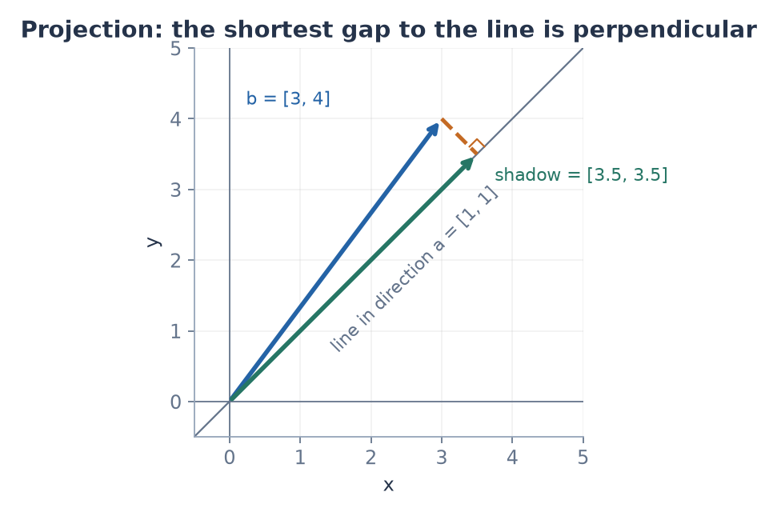

*In the worked example, the green arrow is the projection of b onto the diagonal line. The dashed orange leftover meets that line at a right angle.*

### Exercises

**7.1.** Project $[2, 3]$ onto $[1, 0]$. Draw it. Why is the answer obvious?

**7.2.** Project $[4, 2]$ onto $[1, 2]$. Check that the leftover is perpendicular to $[1, 2]$.

**7.3.** What's the projection of $[3, -1]$ onto $[1, 3]$? What does the answer tell you about these two vectors?

<details>
<summary>Solutions</summary>

**7.1.** $c = \frac{2}{1} = 2$, projection $[2, 0]$. Shining a light straight down onto the x-axis just drops the vertical part.

**7.2.** $c = \frac{4 + 4}{1 + 4} = 1.6$, projection $[1.6, 3.2]$, leftover $[2.4, -1.2]$. Check: $2.4 - 2.4 = 0$ ✓

**7.3.** $\mathbf{a} \cdot \mathbf{b} = 3 - 3 = 0$, so the projection is $[0, 0]$. They're perpendicular, so the shadow has no length.

</details>

---

## 8. Linear combinations, span, independence, and basis

### The problem

Suppose you're only allowed to move in two directions, $\mathbf{u} = [1, 0]$ (east) and $\mathbf{v} = [0, 1]$ (north), taking any amount of each. Where can you get to?

What if the two directions were $[1, 2]$ and $[2, 4]$ instead? These questions lead to the most important ideas in linear algebra.

### Linear combination

A **linear combination** of vectors is: scale each one by some number, then add them up.

$$
c_1\mathbf{v}_1 + c_2\mathbf{v}_2
$$

The numbers $c_1$ and $c_2$ are called **weights** or **coefficients**. (Here the subscripts on the bold $\mathbf{v}_1$, $\mathbf{v}_2$ number **different vectors**, not components.)

**Example.** $3 \cdot [1, 0] + 2 \cdot [0, 1] = [3, 2]$.

It's like a recipe: 3 parts of the first ingredient, 2 parts of the second.

### Span

The **span** of some vectors is **every point you can reach** using linear combinations of them, with any weights at all.

- $\text{span}\{[1, 0], [0, 1]\}$: any point $[x, y]$ is reachable as $x \cdot [1, 0] + y \cdot [0, 1]$. So the span is **the whole plane** $\mathbb{R}^2$.
- $\text{span}\{[1, 2]\}$: all multiples $c \cdot [1, 2]$. That's **a line** through the origin.
- $\text{span}\{[1, 2], [2, 4]\}$: since $[2, 4] = 2 \cdot [1, 2]$, the second vector adds nothing new. Every combination still lies on **the same line**.

(The curly brackets $\{\ \}$ mean "the set of these things.")

### Linear independence

Vectors are **linearly independent** if **none of them can be made from the others**. Each one adds a genuinely new direction.

Vectors are **linearly dependent** if **at least one is a combination of the others**, which makes it redundant.

| Vectors | Independent? | Why | Span |
|---|---|---|---|
| $[1, 0]$, $[0, 1]$ | Yes | Neither is a multiple of the other | the plane |
| $[1, 2]$, $[2, 4]$ | No | $[2, 4] = 2 \cdot [1, 2]$ | a line |
| $[1, 0]$, $[0, 1]$, $[3, 5]$ | No | $[3, 5] = 3[1, 0] + 5[0, 1]$ | the plane |

**A useful fact:** in $\mathbb{R}^2$ you can never have more than 2 independent vectors. The plane only has 2 "genuinely different" directions. In $\mathbb{R}^n$, you can have at most $n$.

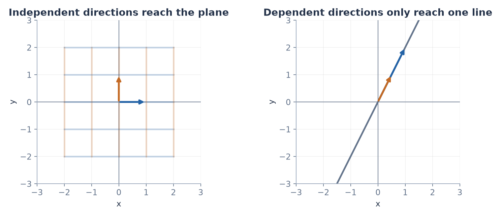

*Multiples and sums of two independent directions can reach any point in the plane. If both directions lie on the same line, every combination stays on that line.*

### Checking whether a point is in a span

**Example.** Is $[3, 5]$ in $\text{span}\{[1, 1], [1, 2]\}$?

We need weights with $c_1[1, 1] + c_2[1, 2] = [3, 5]$. Component by component, that's two equations:

| Step | What we did |
|---|---|
| $c_1 + c_2 = 3$ and $c_1 + 2c_2 = 5$ | First components, then second components |
| $c_2 = 2$ | Subtracted the first equation from the second |
| $c_1 = 1$ | Put $c_2 = 2$ into the first equation |

**Yes:** $1 \cdot [1, 1] + 2 \cdot [1, 2] = [3, 5]$ ✓

### Basis and dimension

A **basis** is a set of vectors that:

1. is **independent** (no redundant vectors), and
2. **spans** the whole space (can reach everything).

It's the smallest possible set of directions that still reaches everywhere.

- The **standard basis** of $\mathbb{R}^2$ is $\mathbf{e}_1 = [1, 0]$ and $\mathbf{e}_2 = [0, 1]$. (Bold $\mathbf{e}$ here is **not** the number $e \approx 2.718$. It's just a name.)
- $\{[1, 1], [1, 2]\}$ is **also** a basis of $\mathbb{R}^2$. A space has many possible bases.

**Every basis of a space has the same number of vectors.** That number is the **dimension**. $\mathbb{R}^2$ has dimension 2, and $\mathbb{R}^n$ has dimension $n$.

### Coordinates are weights

When we write $[3, 2]$, we secretly mean $3\mathbf{e}_1 + 2\mathbf{e}_2$. **The components of a vector are the weights on the standard basis.**

> **Why ML cares:** If two features in a dataset carry the same information (like a price in pesos and the same price in dollars), one is just a multiple of the other, so they're dependent. The redundant one adds no new information, and as you'll see in §15–§16, it can break certain calculations.

### Exercises

**8.1.** Calculate $2[1, -1] + 3[0, 2] - [4, 1]$.

**8.2.** Is $[5, 1]$ in $\text{span}\{[1, 1], [1, -1]\}$? If yes, find the weights.

**8.3.** Are $[1, 2, 3]$, $[2, 4, 6]$, and $[0, 1, 0]$ independent? What shape is their span (a line, a plane, or all of 3D space)?

**8.4.** Is $\{[2, 0], [0, 3]\}$ a basis for $\mathbb{R}^2$? Is $\{[1, 1], [2, 2]\}$?

**8.5.** Can three vectors in $\mathbb{R}^2$ ever be independent? Explain.

<details>
<summary>Hint</summary>

8.2: write two equations, then add them together.
8.3: look for one vector that's a multiple of another.

</details>

<details>
<summary>Solutions</summary>

**8.1.** $[2, -2] + [0, 6] - [4, 1] = [-2, 3]$.

**8.2.** $c_1 + c_2 = 5$ and $c_1 - c_2 = 1$. Adding gives $2c_1 = 6$, so $c_1 = 3$, $c_2 = 2$. Yes.

**8.3.** No: $[2, 4, 6] = 2[1, 2, 3]$. The other two are independent, so the span is a plane.

**8.4.** Yes (independent, and 2 vectors in a 2D space). No: $[2, 2] = 2[1, 1]$, so they only span a line.

**8.5.** No. $\mathbb{R}^2$ only has 2 independent directions, so a third vector is always a combination of two independent ones.

</details>

---

# Part B — Matrices

## 9. Matrices

### The problem

One vector describes one thing. But a dataset has **many** things: 1000 houses, each described by 10 numbers. We need a way to hold many vectors at once, neatly organized.

### Definition

A **matrix** is a rectangular grid of numbers:

$$
A = \begin{bmatrix} 1 & 2 & 3 \\ 4 & 5 & 6 \end{bmatrix}
$$

- Matrices are named with **capital letters**: $A$, $B$, $X$, $W$.
- This one has **2 rows** (going across) and **3 columns** (going down).
- Its **size** or **shape** is "**2 by 3**," written $2 \times 3$. **Rows always come first.**
- We say $A \in \mathbb{R}^{2 \times 3}$: "A is a 2-by-3 grid of real numbers."

### Reading one entry

$A_{ij}$ means **the entry in row $i$, column $j$**. Read aloud as "A i j" (e.g. "A two three").

For the matrix above: $A_{11} = 1$, $A_{13} = 3$, $A_{21} = 4$, $A_{23} = 6$.

**Memory trick:** "**R**oman **C**atholic": **R**ow first, **C**olumn second.

### Rows and columns as vectors

A matrix can be seen as a stack of row vectors, or as a set of column vectors side by side:

- **Rows** of $A$: $[1, 2, 3]$ and $[4, 5, 6]$
- **Columns** of $A$: $\begin{bmatrix}1\\4\end{bmatrix}$, $\begin{bmatrix}2\\5\end{bmatrix}$, $\begin{bmatrix}3\\6\end{bmatrix}$

Both views are useful, and §10 uses both.

### Special matrices

- **Square matrix:** same number of rows and columns, e.g. $2 \times 2$.
- **Diagonal matrix:** a square matrix where only the top-left to bottom-right **diagonal** can be nonzero: $\begin{bmatrix}2 & 0\\0 & 3\end{bmatrix}$.
- **Identity matrix** $I$: diagonal with all 1s: $I = \begin{bmatrix}1 & 0\\0 & 1\end{bmatrix}$. It plays the role of the number 1 (see §10 and §12).
- **Zero matrix:** all zeros.

### Adding matrices and multiplying by a number

Just like vectors: **entry by entry**. The matrices must be the same shape.

$$
\begin{bmatrix}1 & 2\\3 & 4\end{bmatrix} + \begin{bmatrix}10 & 20\\30 & 40\end{bmatrix} = \begin{bmatrix}11 & 22\\33 & 44\end{bmatrix}, \qquad 2\begin{bmatrix}1 & 2\\3 & 4\end{bmatrix} = \begin{bmatrix}2 & 4\\6 & 8\end{bmatrix}
$$

> **Why ML cares:** A dataset is usually stored as a matrix $X$: **each row is one example** (one house), and **each column is one feature** (floor area, rooms, …). 1000 houses with 10 features gives $X \in \mathbb{R}^{1000 \times 10}$. In NumPy, its shape is `(1000, 10)`.

### Exercises

**9.1.** For $B = \begin{bmatrix}7 & 0 & -1\\2 & 5 & 8\\3 & 3 & 4\end{bmatrix}$: what's its shape? What are $B_{12}$, $B_{23}$, $B_{31}$?

**9.2.** Write the second row and the third column of $B$ as vectors.

**9.3.** A table records 4 students' scores on 3 quizzes. If each row is a student, what shape is the matrix? What does entry $(2, 3)$ mean?

**9.4.** Calculate $3\begin{bmatrix}1 & 0\\-2 & 4\end{bmatrix} - I$.

<details>
<summary>Solutions</summary>

**9.1.** $3 \times 3$. $B_{12} = 0$, $B_{23} = 8$, $B_{31} = 3$.

**9.2.** Row 2: $[2, 5, 8]$. Column 3: $\begin{bmatrix}-1\\8\\4\end{bmatrix}$.

**9.3.** $4 \times 3$. Student 2's score on quiz 3.

**9.4.** $\begin{bmatrix}3 & 0\\-6 & 12\end{bmatrix} - \begin{bmatrix}1 & 0\\0 & 1\end{bmatrix} = \begin{bmatrix}2 & 0\\-6 & 11\end{bmatrix}$.

</details>

---

## 10. Multiplying a matrix by a vector

### The problem

Two shops sell rice, eggs, and oil:

| | Rice (per kg) | Eggs (each) | Oil (per bottle) |
|---|---|---|---|
| Shop 1 | ₱50 | ₱8 | ₱90 |
| Shop 2 | ₱45 | ₱9 | ₱100 |

You want 2 kg rice, 12 eggs, 1 bottle of oil. **What's the total at each shop?**

The prices form a matrix, and the quantities form a vector:

$$
A = \begin{bmatrix}50 & 8 & 90\\45 & 9 & 100\end{bmatrix}, \qquad \mathbf{x} = \begin{bmatrix}2\\12\\1\end{bmatrix}
$$

### View 1: each row dotted with the vector

Each shop's total is **its row of prices dotted with the quantities** (§5):

| Shop | Calculation | Total |
|---|---|---|
| 1 | $[50, 8, 90] \cdot [2, 12, 1] = 100 + 96 + 90$ | 286 |
| 2 | $[45, 9, 100] \cdot [2, 12, 1] = 90 + 108 + 100$ | 298 |

This is the **matrix-vector product**:

$$
A\mathbf{x} = \begin{bmatrix}50 & 8 & 90\\45 & 9 & 100\end{bmatrix}\begin{bmatrix}2\\12\\1\end{bmatrix} = \begin{bmatrix}286\\298\end{bmatrix}
$$

Read $A\mathbf{x}$ aloud as "**A times x**." **Row $i$ of the result = row $i$ of $A$, dotted with $\mathbf{x}$.**

### View 2: a weighted mix of the columns

Now look at the columns. Column 1 is "rice prices at each shop," column 2 is "egg prices," column 3 is "oil prices." You take **2 of column 1, 12 of column 2, and 1 of column 3**:

$$
A\mathbf{x} = 2\begin{bmatrix}50\\45\end{bmatrix} + 12\begin{bmatrix}8\\9\end{bmatrix} + 1\begin{bmatrix}90\\100\end{bmatrix} = \begin{bmatrix}100\\90\end{bmatrix} + \begin{bmatrix}96\\108\end{bmatrix} + \begin{bmatrix}90\\100\end{bmatrix} = \begin{bmatrix}286\\298\end{bmatrix}
$$

Same answer. **$A\mathbf{x}$ is a linear combination of $A$'s columns (§8), with the weights given by $\mathbf{x}$.**

**Both views always give the same result.** They're the same additions, just grouped differently. View 1 is easier for calculating. View 2 is more important for understanding.

### The shape rule

For $A\mathbf{x}$ to work, each row of $A$ must be dotted with $\mathbf{x}$, so **the number of columns of $A$ must equal the length of $\mathbf{x}$**:

$$
\underbrace{A}_{m \times n}\ \underbrace{\mathbf{x}}_{n \text{ entries}} = \underbrace{A\mathbf{x}}_{m \text{ entries}}
$$

In the shop example: $2 \times 3$ matrix times 3 entries gives 2 entries (one total per shop).

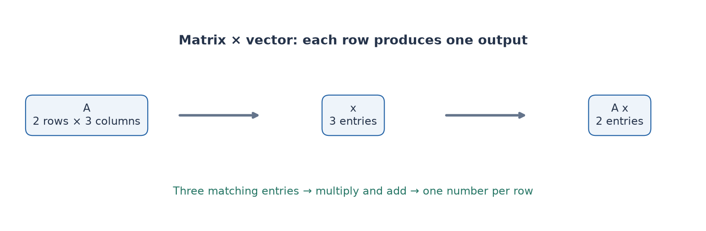

*The vector's entry count must match the matrix's column count. Each row uses the full vector to produce one output, so the output count matches the number of rows.*

### The identity matrix does nothing

$$
I\mathbf{x} = \begin{bmatrix}1 & 0\\0 & 1\end{bmatrix}\begin{bmatrix}x_1\\x_2\end{bmatrix} = \begin{bmatrix}x_1\\x_2\end{bmatrix}
$$

Just like multiplying a number by 1.

> **Why ML cares:** With a data matrix $X$ (one row per house) and a weight vector $\mathbf{w}$, the product $X\mathbf{w}$ computes a weighted total **for every house at once**: 1000 predictions from one multiplication. That's the shop calculation, scaled up.

### Exercises

**10.1.** Calculate $\begin{bmatrix}1 & 2\\3 & 4\end{bmatrix}\begin{bmatrix}5\\6\end{bmatrix}$ using View 1. Then check with View 2.

**10.2.** Calculate $\begin{bmatrix}2 & 0 & -1\\1 & 3 & 2\end{bmatrix}\begin{bmatrix}1\\-1\\2\end{bmatrix}$.

**10.3.** Can you multiply a $3 \times 2$ matrix by a vector with 3 entries? Why or why not?

**10.4.** $A$ is $1000 \times 10$ and $\mathbf{w}$ has 10 entries. How many entries does $A\mathbf{w}$ have? What does each entry mean if rows are houses?

**10.5.** Calculate $\begin{bmatrix}3 & 0\\0 & 3\end{bmatrix}\begin{bmatrix}x\\y\end{bmatrix}$. What does this matrix do to any vector?

<details>
<summary>Solutions</summary>

**10.1.** Row view: $[5 + 12,\ 15 + 24] = [17, 39]$. Column view: $5[1, 3] + 6[2, 4] = [5, 15] + [12, 24] = [17, 39]$ ✓

**10.2.** $[2 + 0 - 2,\ 1 - 3 + 4] = [0, 2]$.

**10.3.** No. The matrix has 2 columns, so the vector needs 2 entries.

**10.4.** 1000 entries: one weighted total (prediction) per house.

**10.5.** $[3x, 3y]$. It scales every vector by 3.

</details>

---

## 11. Matrices as transformations

### The big idea

From Functions §1: a function takes an input and gives an output. **A matrix is a function for vectors**: a vector goes in, and $A\mathbf{x}$ comes out.

$$
\mathbf{x} \ \longmapsto\ A\mathbf{x}
$$

(The arrow $\longmapsto$ is read "maps to" or "goes to.")

If you apply $A$ to **every** point in the plane at once, the whole plane gets moved around: stretched, rotated, flipped, or squashed. So a matrix is a **transformation of space**.

### The one idea to hold onto: columns show where the basis vectors land

Multiply any matrix by $\mathbf{e}_1 = [1, 0]$:

$$
\begin{bmatrix}a & b\\c & d\end{bmatrix}\begin{bmatrix}1\\0\end{bmatrix} = \begin{bmatrix}a\\c\end{bmatrix} = \text{column 1}
$$

And by $\mathbf{e}_2 = [0, 1]$, you get column 2.

**The first column is where $[1, 0]$ lands. The second column is where $[0, 1]$ lands.**

And since any vector is $x_1\mathbf{e}_1 + x_2\mathbf{e}_2$ (§8), the column view from §10 says:

$$
A\mathbf{x} = x_1 \cdot (\text{where } \mathbf{e}_1 \text{ landed}) + x_2 \cdot (\text{where } \mathbf{e}_2 \text{ landed})
$$

**Once you know where the two basis arrows go, you know where everything goes.**

### A catalog of transformations

Each one, explained using the column idea:

**Stretch:** $\begin{bmatrix}2 & 0\\0 & 3\end{bmatrix}$

$[1, 0]$ lands at $[2, 0]$ and $[0, 1]$ lands at $[0, 3]$. Horizontal stretches by 2, vertical by 3.

**Reflection across the y-axis:** $\begin{bmatrix}-1 & 0\\0 & 1\end{bmatrix}$

$[1, 0]$ flips to $[-1, 0]$, and $[0, 1]$ stays. A mirror image.

**Shear:** $\begin{bmatrix}1 & 1\\0 & 1\end{bmatrix}$

$[1, 0]$ stays, and $[0, 1]$ lands at $[1, 1]$. Squares lean over into slanted shapes, like pushing the top of a deck of cards sideways.

Example: $[2, 3] \mapsto 2[1, 0] + 3[1, 1] = [5, 3]$.

**Squash onto the x-axis:** $\begin{bmatrix}1 & 0\\0 & 0\end{bmatrix}$

$[0, 1]$ lands at $[0, 0]$. The whole plane collapses onto a line. **Information is lost**: $[1, 0]$ and $[1, 5]$ both land on $[1, 0]$.

**Rotation by angle $\theta$ (counterclockwise):**

$$
R_\theta = \begin{bmatrix}\cos\theta & -\sin\theta\\ \sin\theta & \cos\theta\end{bmatrix}
$$

Why these columns:

- **Column 1:** rotating $[1, 0]$ by $\theta$ lands at $[\cos\theta, \sin\theta]$. That's exactly the circle picture from §4.
- **Column 2:** $[0, 1]$ is $[1, 0]$ already turned by $90°$. Turning any vector $[p, q]$ by $90°$ gives $[-q, p]$ (check: $[1, 0] \to [0, 1] \to [-1, 0]$). So $[0, 1]$ lands at $[\cos\theta, \sin\theta]$ turned $90°$, which is $[-\sin\theta, \cos\theta]$.

For $90°$: $R_{90°} = \begin{bmatrix}0 & -1\\1 & 0\end{bmatrix}$. Example: $[2, 1] \mapsto 2[0, 1] + 1[-1, 0] = [-1, 2]$.

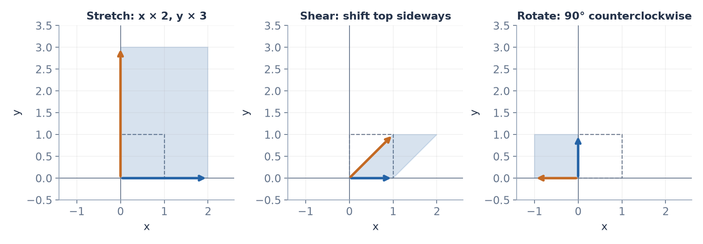

*The dashed square is the input; the shaded shape is its image. Blue and orange arrows show where the two basis directions land. These are transformations from the catalog above.*

### What matrix transformations always do

Every matrix transformation is **linear** (Functions §5):

- $A(\mathbf{u} + \mathbf{v}) = A\mathbf{u} + A\mathbf{v}$
- $A(c\,\mathbf{u}) = c\,(A\mathbf{u})$

In pictures: **straight lines stay straight, the origin stays put, and evenly spaced grid lines stay evenly spaced.** They can stretch, rotate, flip, shear, or squash, but never bend.

> **Why ML cares:** A layer in a neural network includes a matrix that transforms its input vector into a new vector, often of a different size: for example, turning a 63-number hand position into a 256-number internal description. The network alternates: transform with a matrix, then bend with an activation function (Functions §8), then transform, then bend.

### Exercises

**11.1.** What matrix sends $[1, 0]$ to $[3, 1]$ and $[0, 1]$ to $[-1, 2]$? Where does it send $[2, 2]$?

**11.2.** Write the matrix that rotates by $180°$. Apply it to $[4, -1]$.

**11.3.** Write the matrix that reflects across the x-axis (flips up and down).

**11.4.** What does $\begin{bmatrix}2 & 0\\0 & 0.5\end{bmatrix}$ do to a 1×1 square with corners $(0, 0)$, $(1, 0)$, $(1, 1)$, $(0, 1)$? What's the new area?

**11.5.** Which transformation in the catalog can't be undone, and why?

<details>
<summary>Hint</summary>

11.1: the columns are just the landing spots.
11.2: use $\cos 180° = -1$ and $\sin 180° = 0$.

</details>

<details>
<summary>Solutions</summary>

**11.1.** $\begin{bmatrix}3 & -1\\1 & 2\end{bmatrix}$. $[2, 2] \mapsto 2[3, 1] + 2[-1, 2] = [4, 6]$.

**11.2.** $\begin{bmatrix}-1 & 0\\0 & -1\end{bmatrix}$ gives $[-4, 1]$.

**11.3.** $\begin{bmatrix}1 & 0\\0 & -1\end{bmatrix}$.

**11.4.** It becomes a $2 \times 0.5$ rectangle. Area $= 1$, unchanged.

**11.5.** The squash. Different points land on the same spot, so you can't tell where a point started.

</details>

---

## 12. Multiplying two matrices

### The problem

Apply transformation $B$ to a vector, then apply transformation $A$ to the result: $A(B\mathbf{x})$. This is **composition** (Functions §3).

Could we replace those two steps with **one single matrix** that does both? Yes, and finding it is matrix multiplication.

### Figuring out what the combined matrix must be

Call the combined matrix $AB$. From §11, its columns must be **where the basis vectors end up after both steps**:

- Column 1 of $AB$ = where $\mathbf{e}_1$ ends up = $A(B\mathbf{e}_1)$ = $A$ times (column 1 of $B$)
- Column 2 of $AB$ = $A$ times (column 2 of $B$)

So: **each column of $AB$ is $A$ multiplied by the matching column of $B$.** You already know how to multiply a matrix by a vector (§10).

### The entry rule

Doing that multiplication with View 1 (row dotted with vector) gives the standard rule:

$$
(AB)_{ij} = (\text{row } i \text{ of } A) \cdot (\text{column } j \text{ of } B)
$$

### Worked example

$$
A = \begin{bmatrix}1 & 2\\3 & 4\end{bmatrix}, \qquad B = \begin{bmatrix}5 & 6\\7 & 8\end{bmatrix}
$$

| Entry | Row of $A$ | Column of $B$ | Dot product |
|---|---|---|---|
| $(1,1)$ | $[1, 2]$ | $[5, 7]$ | $5 + 14 = 19$ |
| $(1,2)$ | $[1, 2]$ | $[6, 8]$ | $6 + 16 = 22$ |
| $(2,1)$ | $[3, 4]$ | $[5, 7]$ | $15 + 28 = 43$ |
| $(2,2)$ | $[3, 4]$ | $[6, 8]$ | $18 + 32 = 50$ |

$$
AB = \begin{bmatrix}19 & 22\\43 & 50\end{bmatrix}
$$

### The shape rule

A row of $A$ must be dotted with a column of $B$, so they must have the same length: **the columns of $A$ must equal the rows of $B$.**

$$
\underbrace{A}_{m \times n}\ \underbrace{B}_{n \times p} = \underbrace{AB}_{m \times p}
$$

The inside numbers must match. The outside numbers give the result's shape.

**Example.** A $2 \times 3$ matrix times a $3 \times 2$ matrix:

$$
\begin{bmatrix}1 & 0 & 2\\-1 & 3 & 1\end{bmatrix}\begin{bmatrix}3 & 1\\2 & 1\\1 & 0\end{bmatrix}
$$

Shapes: $(2 \times 3)(3 \times 2)$. The inside 3s match, so the result is $2 \times 2$.

| Entry | Row | Column | Dot product |
|---|---|---|---|
| $(1,1)$ | $[1, 0, 2]$ | $[3, 2, 1]$ | $3 + 0 + 2 = 5$ |
| $(1,2)$ | $[1, 0, 2]$ | $[1, 1, 0]$ | $1 + 0 + 0 = 1$ |
| $(2,1)$ | $[-1, 3, 1]$ | $[3, 2, 1]$ | $-3 + 6 + 1 = 4$ |
| $(2,2)$ | $[-1, 3, 1]$ | $[1, 1, 0]$ | $-1 + 3 + 0 = 2$ |

Result: $\begin{bmatrix}5 & 1\\4 & 2\end{bmatrix}$.

### Order matters: $AB \ne BA$

Swap the order in the first example:

$$
BA = \begin{bmatrix}5 & 6\\7 & 8\end{bmatrix}\begin{bmatrix}1 & 2\\3 & 4\end{bmatrix} = \begin{bmatrix}23 & 34\\31 & 46\end{bmatrix} \ne AB
$$

**Why, geometrically:** $AB$ means "do $B$ first, then $A$." Stretching then rotating isn't the same as rotating then stretching, just as $f(g(x)) \ne g(f(x))$ in general.

**Note the order:** in $AB\mathbf{x}$, the matrix **closest to $\mathbf{x}$ acts first**. It reads right to left, like $f(g(x))$.

### Rules that do hold

- **Grouping doesn't matter:** $(AB)C = A(BC)$. You can multiply neighbors in any grouping, as long as the order stays the same.
- **Identity:** $AI = IA = A$.

### Warning: this is not entry-by-entry multiplication

Matrix multiplication is **not** "multiply matching entries." That entry-by-entry operation also exists. It's written $A \odot B$ and has the long name **Hadamard product**, but it's a different thing.

In Python: `A @ B` is matrix multiplication, and `A * B` is entry-by-entry. Mixing them up gives wrong numbers without any error message.

> **Why ML cares:** A neural network with several layers applies several matrices one after another. Every shape in the network must follow the "inside numbers match" rule. When ML code crashes with a shape error, it's this rule being broken.

### Exercises

**12.1.** Calculate $\begin{bmatrix}1 & 2\\3 & 4\end{bmatrix}\begin{bmatrix}2 & 0\\1 & 3\end{bmatrix}$.

**12.2.** $A$ is $4 \times 2$, $B$ is $2 \times 5$, $C$ is $5 \times 1$. What's the shape of $ABC$? Is $BA$ possible? Is $CB$?

**12.3.** Let $R = \begin{bmatrix}0 & -1\\1 & 0\end{bmatrix}$ (rotate $90°$) and $S = \begin{bmatrix}2 & 0\\0 & 1\end{bmatrix}$ (stretch horizontally). Calculate $RS$ and $SR$. Apply each to $[1, 0]$ and describe in words what happened.

**12.4.** Calculate $\begin{bmatrix}1 & 2\\3 & 4\end{bmatrix} \odot \begin{bmatrix}2 & 0\\1 & 3\end{bmatrix}$ (entry by entry) and compare with 12.1.

**12.5.** Show that $\begin{bmatrix}1 & 2\\3 & 4\end{bmatrix} I = \begin{bmatrix}1 & 2\\3 & 4\end{bmatrix}$ by calculating.

<details>
<summary>Hint</summary>

12.2: write the shapes in a row and check that each pair of neighboring inside numbers matches.
12.3: $RS[1, 0]$ means stretch first, then rotate.

</details>

<details>
<summary>Solutions</summary>

**12.1.** $\begin{bmatrix}2 + 2 & 0 + 6\\6 + 4 & 0 + 12\end{bmatrix} = \begin{bmatrix}4 & 6\\10 & 12\end{bmatrix}$.

**12.2.** $(4 \times 2)(2 \times 5)(5 \times 1) = 4 \times 1$. $BA$: $(2 \times 5)(4 \times 2)$, $5 \ne 4$, not possible. $CB$: $(5 \times 1)(2 \times 5)$, $1 \ne 2$, not possible.

**12.3.** $RS = \begin{bmatrix}0 & -1\\2 & 0\end{bmatrix}$ and $SR = \begin{bmatrix}0 & -2\\1 & 0\end{bmatrix}$. $RS[1, 0] = [0, 2]$: stretched to $[2, 0]$, then rotated up. $SR[1, 0] = [0, 1]$: rotated to $[0, 1]$ first, and the horizontal stretch then does nothing to a vertical arrow.

**12.4.** $\begin{bmatrix}2 & 0\\3 & 12\end{bmatrix}$. Completely different from 12.1.

</details>

---

## 13. Transpose and symmetric matrices

### Transpose

The **transpose** of a matrix flips it across its diagonal: **rows become columns**.

$$
A = \begin{bmatrix}1 & 2 & 3\\4 & 5 & 6\end{bmatrix} \quad\Longrightarrow\quad A^\top = \begin{bmatrix}1 & 4\\2 & 5\\3 & 6\end{bmatrix}
$$

- Read $A^\top$ aloud as "**A transpose**." (The raised T is not an exponent.)
- Shape $m \times n$ becomes $n \times m$.
- Entry rule: $(A^\top)_{ij} = A_{ji}$.

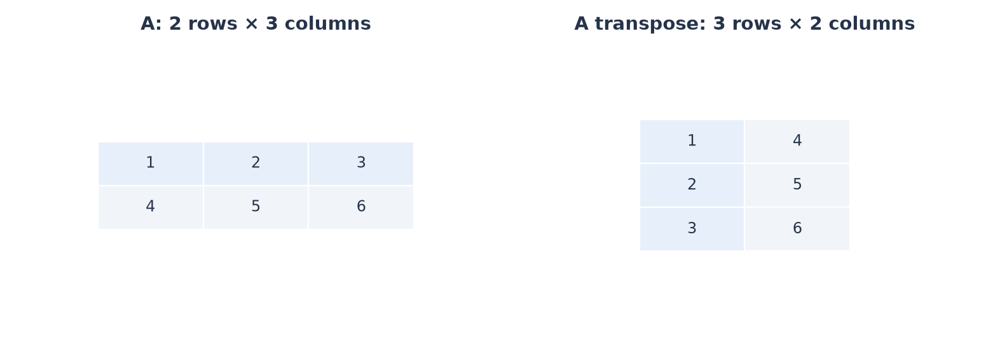

*The highlighted first row becomes the highlighted first column. Transposing swaps row and column positions while keeping the values.*

### Rows vs. columns finally matters

Now we can say precisely: a **column vector** is an $n \times 1$ matrix, and a **row vector** is a $1 \times n$ matrix. Transpose turns one into the other.

This lets us write the dot product as a matrix multiplication:

$$
\mathbf{a}^\top\mathbf{b} = \begin{bmatrix}a_1 & a_2\end{bmatrix}\begin{bmatrix}b_1\\b_2\end{bmatrix} = a_1b_1 + a_2b_2 = \mathbf{a} \cdot \mathbf{b}
$$

Shapes: $(1 \times 2)(2 \times 1) = 1 \times 1$, a single number ✓. You'll see $\mathbf{a}^\top\mathbf{b}$ written for dot products all the time.

### Transpose rules

- $(A^\top)^\top = A$ (flipping twice gets you back)
- $(A + B)^\top = A^\top + B^\top$
- $(AB)^\top = B^\top A^\top$ ← **the order reverses**

**Check the last one with numbers.** With $A = \begin{bmatrix}1 & 2\\3 & 4\end{bmatrix}$ and $B = \begin{bmatrix}5 & 6\\7 & 8\end{bmatrix}$, we found $AB = \begin{bmatrix}19 & 22\\43 & 50\end{bmatrix}$, so $(AB)^\top = \begin{bmatrix}19 & 43\\22 & 50\end{bmatrix}$.

$$
B^\top A^\top = \begin{bmatrix}5 & 7\\6 & 8\end{bmatrix}\begin{bmatrix}1 & 3\\2 & 4\end{bmatrix} = \begin{bmatrix}19 & 43\\22 & 50\end{bmatrix} \ ✓
$$

(Try $A^\top B^\top$ instead: you get $\begin{bmatrix}23 & 31\\34 & 46\end{bmatrix}$, which doesn't match.)

**Why the order reverses:** like socks and shoes. You put on socks, then shoes. To undo, you take off shoes first, then socks.

### Symmetric matrices

A square matrix is **symmetric** if $A^\top = A$: it's a mirror image across its diagonal.

$$
\begin{bmatrix}2 & 7\\7 & 5\end{bmatrix} \text{ is symmetric.} \qquad \begin{bmatrix}2 & 7\\1 & 5\end{bmatrix} \text{ is not.}
$$

**A useful fact:** for **any** matrix $X$, the product $X^\top X$ is square and symmetric.

**Why:** $(X^\top X)^\top = X^\top (X^\top)^\top = X^\top X$, using the reverse-order rule, then flip-twice.

> **Why ML cares:** For a data matrix $X$, the matrix $X^\top X$ appears in the formula for fitting lines (§17), and a close relative of it (the covariance matrix, in Statistics) is how ML measures which features vary together.

### Exercises

**13.1.** Find the transpose of $\begin{bmatrix}1 & -2\\0 & 3\\4 & 5\end{bmatrix}$. What are the shapes before and after?

**13.2.** Write $[2, 1, 3] \cdot [4, 0, -1]$ as $\mathbf{a}^\top\mathbf{b}$ and calculate it.

**13.3.** For $X$ of shape $1000 \times 10$: what's the shape of $X^\top X$? Of $XX^\top$?

**13.4.** Calculate $X^\top X$ for $X = \begin{bmatrix}1 & 2\\3 & 4\\5 & 6\end{bmatrix}$. Check that it's symmetric.

<details>
<summary>Solutions</summary>

**13.1.** $\begin{bmatrix}1 & 0 & 4\\-2 & 3 & 5\end{bmatrix}$. $3 \times 2$ becomes $2 \times 3$.

**13.2.** $8 + 0 - 3 = 5$.

**13.3.** $10 \times 10$ and $1000 \times 1000$.

**13.4.** $X^\top = \begin{bmatrix}1 & 3 & 5\\2 & 4 & 6\end{bmatrix}$. $X^\top X = \begin{bmatrix}1 + 9 + 25 & 2 + 12 + 30\\2 + 12 + 30 & 4 + 16 + 36\end{bmatrix} = \begin{bmatrix}35 & 44\\44 & 56\end{bmatrix}$. Symmetric ✓

</details>

---

## 14. The determinant

### The problem

Transformations stretch and squash space. **By how much?** If you transform a 1×1 square, what's the area of the shape it becomes?

### The answer: one number

For a $2 \times 2$ matrix:

$$
\det\begin{bmatrix}a & b\\c & d\end{bmatrix} = ad - bc
$$

Read $\det(A)$ aloud as "**the determinant of A**." (Sometimes written $|A|$, which is confusingly the same symbol as absolute value.)

**The determinant is the factor by which the matrix scales areas.**

### Check with transformations from §11

| Matrix | What it does | Area of transformed unit square | $ad - bc$ |
|---|---|---|---|
| $\begin{bmatrix}2 & 0\\0 & 3\end{bmatrix}$ | stretch 2 × 3 | 6 | $6 - 0 = 6$ ✓ |
| $\begin{bmatrix}1 & 1\\0 & 1\end{bmatrix}$ | shear | 1 (leans over, same base and height) | $1 - 0 = 1$ ✓ |
| $\begin{bmatrix}1 & 0\\0 & 0\end{bmatrix}$ | squash to a line | 0 | $0 - 0 = 0$ ✓ |
| $\begin{bmatrix}-1 & 0\\0 & 1\end{bmatrix}$ | reflect | 1, but flipped | $-1 - 0 = -1$ |

### What the sign and zero mean

- **Positive:** areas scale by that factor, and the orientation is normal.
- **Negative:** the plane got **flipped** like a mirror image, and areas scale by the absolute value.
- **Zero:** space got **squashed** into a line (or a point). Area becomes 0, and **information is lost**.

**A zero determinant is the most important case.** It connects to independence: a zero determinant means the columns are **dependent** (they point along the same line), so they can only reach a line, not the whole plane.

**Example.** $\det\begin{bmatrix}2 & 1\\4 & 2\end{bmatrix} = 4 - 4 = 0$. Look at the columns: $[2, 4]$ and $[1, 2]$. The first is twice the second, so they're dependent ✓

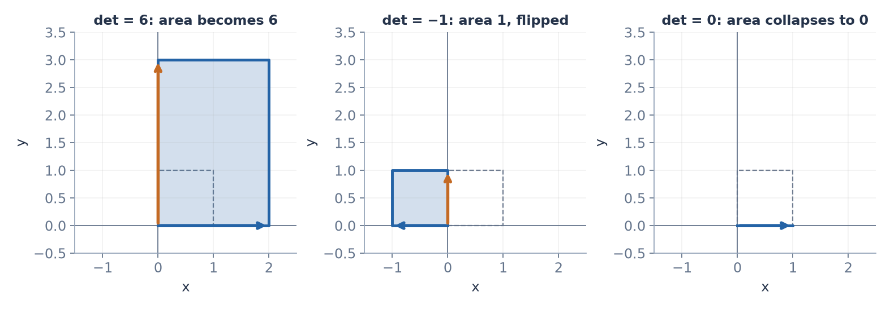

*The absolute determinant gives the area multiplier. A negative sign records an orientation flip; zero means a square has collapsed into a line or point.*

### Bigger matrices

For $3 \times 3$ and larger, the determinant is the **volume** scaling factor, with the same meaning for sign and zero. The hand formulas get long and aren't worth memorizing. In code, use `np.linalg.det(A)`.

> **Why ML cares:** You'll rarely compute determinants directly in ML. What matters is the meaning of **zero**: the matrix squashes space, loses information, and (next section) can't be undone.

### Exercises

**14.1.** Calculate $\det\begin{bmatrix}3 & 1\\2 & 4\end{bmatrix}$.

**14.2.** Calculate $\det\begin{bmatrix}6 & 3\\4 & 2\end{bmatrix}$. What does the answer tell you about the columns?

**14.3.** What's the determinant of the $90°$ rotation $\begin{bmatrix}0 & -1\\1 & 0\end{bmatrix}$? Why does that make sense?

**14.4.** A matrix has determinant $-2$. A shape with area 5 is transformed. What's the new area, and what else happened?

<details>
<summary>Solutions</summary>

**14.1.** $12 - 2 = 10$.

**14.2.** $12 - 12 = 0$. The columns $[6, 4]$ and $[3, 2]$ are dependent (the first is twice the second).

**14.3.** $0 - (-1) = 1$. Rotating doesn't change area or flip anything.

**14.4.** Area 10, and the shape was mirror-flipped.

</details>

---

## 15. The inverse matrix

### The problem

Matrix $A$ transforms space. Is there a matrix that **undoes** it, putting every point back where it started? (This is the inverse function idea from Functions §4.)

### Definition

The **inverse** of a square matrix $A$ is a matrix $A^{-1}$ (read "**A inverse**") such that:

$$
A^{-1}A = I \quad\text{and}\quad AA^{-1} = I
$$

Transform, then undo = do nothing at all.

(Like with functions, $A^{-1}$ does **not** mean "1 divided by each entry.")

### Example: undoing a rotation

Rotating by $90°$ counterclockwise is undone by rotating $90°$ **clockwise**:

$$
\begin{bmatrix}0 & -1\\1 & 0\end{bmatrix}\begin{bmatrix}0 & 1\\-1 & 0\end{bmatrix} = \begin{bmatrix}0 \cdot 0 + (-1)(-1) & 0 \cdot 1 + (-1) \cdot 0\\1 \cdot 0 + 0 \cdot (-1) & 1 \cdot 1 + 0 \cdot 0\end{bmatrix} = \begin{bmatrix}1 & 0\\0 & 1\end{bmatrix} \ ✓
$$

### When does an inverse exist?

**Only when the determinant is not zero.**

**Why:** if $\det A = 0$, then $A$ squashes the plane onto a line, so many different points land on the same spot. You can't know which one to send back, just like $x^2$ had no inverse (Functions §4).

All of these say the same thing about a square matrix $A$:

- $A$ has an inverse
- $\det A \ne 0$
- the columns of $A$ are independent
- $A$ doesn't squash space into a lower dimension

### The $2 \times 2$ formula

$$
\begin{bmatrix}a & b\\c & d\end{bmatrix}^{-1} = \frac{1}{ad - bc}\begin{bmatrix}d & -b\\-c & a\end{bmatrix}
$$

In words: **swap** the diagonal entries, **negate** the other two, and **divide everything by the determinant**. (You can see why it fails when the determinant is 0: you'd be dividing by zero.)

**Example.** $A = \begin{bmatrix}4 & 7\\2 & 6\end{bmatrix}$

| Step | Result |
|---|---|
| Determinant | $24 - 14 = 10$ |
| Swap diagonal, negate the others | $\begin{bmatrix}6 & -7\\-2 & 4\end{bmatrix}$ |
| Divide by 10 | $A^{-1} = \begin{bmatrix}0.6 & -0.7\\-0.2 & 0.4\end{bmatrix}$ |

**Check:** $AA^{-1} = \begin{bmatrix}4(0.6) + 7(-0.2) & 4(-0.7) + 7(0.4)\\2(0.6) + 6(-0.2) & 2(-0.7) + 6(0.4)\end{bmatrix} = \begin{bmatrix}1 & 0\\0 & 1\end{bmatrix}$ ✓

### In code: avoid computing inverses

Computing an inverse is slow and sensitive to rounding errors for big matrices. In practice, to find $\mathbf{x}$ with $A\mathbf{x} = \mathbf{b}$, use `np.linalg.solve(A, b)` instead of `np.linalg.inv(A) @ b`.

> **Why ML cares:** One formula for fitting a line to data (§17) contains an inverse. If two features are dependent (§8), that matrix has determinant 0, so the inverse doesn't exist and the calculation breaks.

### Exercises

**15.1.** Find the inverse of $\begin{bmatrix}3 & 1\\2 & 4\end{bmatrix}$, and check your answer by multiplying.

**15.2.** Does $\begin{bmatrix}1 & 2\\2 & 4\end{bmatrix}$ have an inverse? Explain in terms of the determinant, the columns, and the picture.

**15.3.** What's the inverse of the stretch $\begin{bmatrix}2 & 0\\0 & 5\end{bmatrix}$? Explain it in words first, then check with the formula.

**15.4.** If $A$ rotates by $30°$, describe $A^{-1}$ in words.

<details>
<summary>Solutions</summary>

**15.1.** $\frac{1}{10}\begin{bmatrix}4 & -1\\-2 & 3\end{bmatrix} = \begin{bmatrix}0.4 & -0.1\\-0.2 & 0.3\end{bmatrix}$. Check: first row of the product is $[1.2 - 0.2,\ -0.3 + 0.3] = [1, 0]$ ✓

**15.2.** No. The determinant is $4 - 4 = 0$, the columns are dependent ($[2, 4] = 2[1, 2]$), and the plane gets squashed onto a line.

**15.3.** Undo the stretches: shrink horizontally by 2 and vertically by 5. $\begin{bmatrix}0.5 & 0\\0 & 0.2\end{bmatrix}$. The formula gives $\frac{1}{10}\begin{bmatrix}5 & 0\\0 & 2\end{bmatrix}$, the same thing.

**15.4.** Rotate by $30°$ clockwise.

</details>

---

## 16. Systems of equations and rank

### The problem

Solve these two equations together:

$$
2x + y = 5, \qquad x - y = 1
$$

This is called a **system of equations**: several equations that must all be true at the same time.

### Solving by hand

| Step | What we did |
|---|---|
| $3x = 6$ | Added the two equations: the $y$ and $-y$ cancel |
| $x = 2$ | Divided by 3 |
| $2(2) + y = 5 \Rightarrow y = 1$ | Put $x = 2$ into the first equation |

**Check** in the second equation: $2 - 1 = 1$ ✓

### As a matrix equation

The same system, written with a matrix:

$$
\begin{bmatrix}2 & 1\\1 & -1\end{bmatrix}\begin{bmatrix}x\\y\end{bmatrix} = \begin{bmatrix}5\\1\end{bmatrix}, \qquad\text{or}\qquad A\mathbf{x} = \mathbf{b}
$$

(Multiply out the left side using §10 to see it gives exactly the two equations.)

### What it's really asking

By the column view (§10), $A\mathbf{x}$ is a mix of $A$'s columns. So $A\mathbf{x} = \mathbf{b}$ asks:

> **"What weights on the columns of $A$ produce $\mathbf{b}$?"**

That's the span question from §8.

### Three possible outcomes

| Outcome | When | Picture (each equation is a line) |
|---|---|---|
| **Exactly one solution** | columns independent ($\det A \ne 0$) | two lines cross at one point |
| **No solution** | $\mathbf{b}$ is outside the span of the columns | parallel lines that never meet |
| **Infinitely many** | columns dependent, and $\mathbf{b}$ happens to be in their span | the two equations are the same line |

When there's exactly one solution, it's $\mathbf{x} = A^{-1}\mathbf{b}$ (§15).

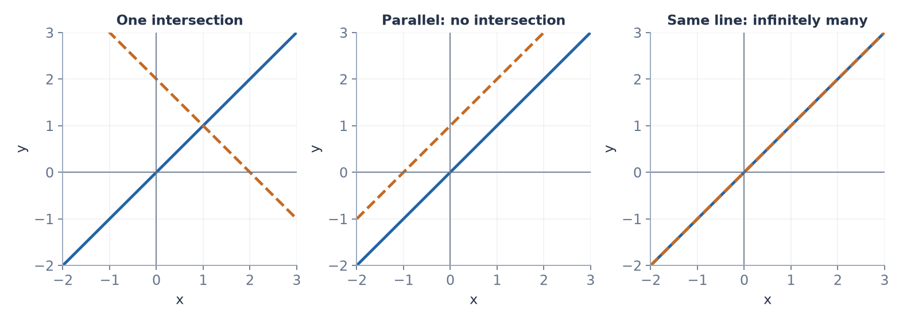

*Separate demonstrations: a solution must lie on both lines. Crossing lines give one point, parallel distinct lines give none, and coincident lines share all their points.*

### Rank

The **rank** of a matrix is **the number of independent columns** it has. Equivalently, it's the dimension of the span of its columns (the space its outputs can reach).

**Example.** $\begin{bmatrix}1 & 2 & 3\\2 & 4 & 6\\1 & 0 & 1\end{bmatrix}$

Look at the rows: row 2 is twice row 1, and row 3 isn't a multiple of row 1. So there are 2 independent rows. (A proven fact: the number of independent rows always equals the number of independent columns.) **Rank 2.**

- A matrix has **full rank** if its rank is as large as its shape allows.
- A square matrix with full rank is exactly one with $\det \ne 0$, which is exactly one with an inverse.

### More equations than unknowns

What if there are **3 equations but only 2 unknowns**? Three lines usually don't all cross at a single point, so there's usually **no exact solution**.

The next best thing is the $\mathbf{x}$ that makes $A\mathbf{x}$ **as close as possible** to $\mathbf{b}$. That's the subject of §17.

> **Why ML cares:** Fitting a model to 1000 data points with 10 adjustable numbers is like 1000 equations with 10 unknowns: no exact solution. So instead of "solve exactly," ML asks "get as close as possible." And rank tells you whether your features contain redundant information.

### Exercises

**16.1.** Solve $x + 2y = 7$ and $3x - y = 7$. Then write the system as $A\mathbf{x} = \mathbf{b}$.

**16.2.** Solve $x + y = 2$ and $2x + 2y = 5$. What happens? Why, in terms of the picture?

**16.3.** Find the rank of $\begin{bmatrix}1 & 2\\3 & 6\end{bmatrix}$ and of $\begin{bmatrix}1 & 2\\3 & 5\end{bmatrix}$.

**16.4.** A $500 \times 20$ data matrix has rank 17. What does that tell you about the 20 features?

<details>
<summary>Hint</summary>

16.1: multiply the second equation by 2, then add it to the first.
16.2: multiply the first equation by 2 and compare.

</details>

<details>
<summary>Solutions</summary>

**16.1.** $6x - 2y = 14$, added to $x + 2y = 7$, gives $7x = 21$, so $x = 3$ and $y = 2$. $\begin{bmatrix}1 & 2\\3 & -1\end{bmatrix}\begin{bmatrix}x\\y\end{bmatrix} = \begin{bmatrix}7\\7\end{bmatrix}$.

**16.2.** Doubling the first gives $2x + 2y = 4$, but the second says $= 5$. Impossible, so no solution. The lines are parallel.

**16.3.** Rank 1 (second column is twice the first). Rank 2 (determinant $5 - 6 = -1 \ne 0$).

**16.4.** 3 of the features are redundant: they're combinations of the others.

</details>

---

## 17. Orthogonality and least squares

### Orthogonal and orthonormal

- Vectors are **orthogonal** if every pair has dot product 0 (§5): all mutually perpendicular.
- They're **orthonormal** if they're orthogonal **and** each has length 1.

The standard basis $[1, 0]$, $[0, 1]$ is orthonormal.

An **orthogonal matrix** $Q$ has orthonormal columns. It has a beautiful property:

$$
Q^\top Q = I \quad\text{so}\quad Q^{-1} = Q^\top
$$

**Why:** entry $(i, j)$ of $Q^\top Q$ is (column $i$) $\cdot$ (column $j$). That's 1 when $i = j$ (length 1) and 0 otherwise (perpendicular). That's exactly $I$.

Geometrically, orthogonal matrices are **rotations and reflections**: they move things without changing any lengths or angles.

### The problem: getting as close as possible

From §16: $A\mathbf{x} = \mathbf{b}$ often has no solution, because $\mathbf{b}$ isn't in the span of $A$'s columns. So find the $\mathbf{x}$ that makes $A\mathbf{x}$ **as close as possible** to $\mathbf{b}$.

### The geometric answer

$A\mathbf{x}$ can only be points in the span of the columns. The closest such point to $\mathbf{b}$ is the **projection** of $\mathbf{b}$ onto that span (§7), where the leftover arrow $\mathbf{b} - A\mathbf{x}$ is **perpendicular to every column of $A$**.

"Perpendicular to every column" means "dot product 0 with every column." And multiplying by $A^\top$ computes exactly those dot products (each row of $A^\top$ is a column of $A$):

| Step | What we did |
|---|---|
| $A^\top(\mathbf{b} - A\mathbf{x}) = \mathbf{0}$ | Leftover perpendicular to every column |
| $A^\top\mathbf{b} - A^\top A\mathbf{x} = \mathbf{0}$ | Distributed |
| $A^\top A\,\mathbf{x} = A^\top\mathbf{b}$ | Moved one term to the other side |

These are called the **normal equations**. ("Normal" is an old word for perpendicular.) Solving them gives the **least squares** answer: it makes the total squared distance $\lVert \mathbf{b} - A\mathbf{x} \rVert^2$ as small as possible.

### Worked example: fitting a line

Three points: $(1, 2)$, $(2, 4)$, $(3, 7)$. Find the line $y = m\,t + c$ that fits them best. (Using $t$ for the input here, so $x$ stays free for the unknowns.)

Each point gives an equation $c + m\,t = y$:

$$
\begin{bmatrix}1 & 1\\1 & 2\\1 & 3\end{bmatrix}\begin{bmatrix}c\\m\end{bmatrix} = \begin{bmatrix}2\\4\\7\end{bmatrix}
$$

(The first column is all 1s because $c$ is multiplied by 1 in every equation.) Three equations, two unknowns, no exact solution. So solve the normal equations:

| Step | Result |
|---|---|
| $A^\top A$ | $\begin{bmatrix}1+1+1 & 1+2+3\\1+2+3 & 1+4+9\end{bmatrix} = \begin{bmatrix}3 & 6\\6 & 14\end{bmatrix}$ |
| $A^\top\mathbf{b}$ | $\begin{bmatrix}2+4+7\\2+8+21\end{bmatrix} = \begin{bmatrix}13\\31\end{bmatrix}$ |
| $(A^\top A)^{-1}$ | determinant $42 - 36 = 6$, so $\frac{1}{6}\begin{bmatrix}14 & -6\\-6 & 3\end{bmatrix}$ |
| $\begin{bmatrix}c\\m\end{bmatrix} = (A^\top A)^{-1}A^\top\mathbf{b}$ | $\frac{1}{6}\begin{bmatrix}14(13) - 6(31)\\-6(13) + 3(31)\end{bmatrix} = \frac{1}{6}\begin{bmatrix}-4\\15\end{bmatrix} = \begin{bmatrix}-0.667\\2.5\end{bmatrix}$ |

The best-fit line is $y = 2.5t - 0.667$. You'll get this exact same line again in Statistics and ML Mathematics, using completely different methods.

> **Why ML cares:** "Find the line (or model) that fits the data best" is the most basic ML task, called **linear regression**. The geometry here is what's underneath it.

### Exercises

**17.1.** Check that $Q = \begin{bmatrix}0 & -1\\1 & 0\end{bmatrix}$ is orthogonal by calculating $Q^\top Q$.

**17.2.** Fit the best line through $(0, 1)$, $(1, 3)$, $(2, 5)$ using the normal equations. Is the fit exact? Why?

**17.3.** Explain in two sentences, without formulas, why the best approximate solution must leave a leftover perpendicular to the columns.

<details>
<summary>Hint</summary>

17.2: $A = \begin{bmatrix}1 & 0\\1 & 1\\1 & 2\end{bmatrix}$, $\mathbf{b} = [1, 3, 5]$.

</details>

<details>
<summary>Solutions</summary>

**17.1.** $\begin{bmatrix}0 & 1\\-1 & 0\end{bmatrix}\begin{bmatrix}0 & -1\\1 & 0\end{bmatrix} = \begin{bmatrix}1 & 0\\0 & 1\end{bmatrix}$ ✓

**17.2.** $A^\top A = \begin{bmatrix}3 & 3\\3 & 5\end{bmatrix}$, $A^\top\mathbf{b} = [9, 13]$. Determinant $6$, inverse $\frac{1}{6}\begin{bmatrix}5 & -3\\-3 & 3\end{bmatrix}$. So $[c, m] = \frac{1}{6}[45 - 39,\ -27 + 39] = [1, 2]$: $y = 2t + 1$. Exact, because all three points already lie on that line.

**17.3.** The reachable points form a flat space (the span of the columns), and the closest point in a flat space is straight "below" $\mathbf{b}$. If the leftover leaned along any column direction, moving along that direction would get closer.

</details>

---

## 18. Eigenvalues and eigenvectors

### The problem

When a matrix transforms space, most arrows get **knocked off their original direction**. But some special arrows might **stay on their own line**, only getting longer, shorter, or flipped.

Let's see this happen with $A = \begin{bmatrix}2 & 1\\1 & 2\end{bmatrix}$:

| Vector $\mathbf{v}$ | $A\mathbf{v}$ | Same direction? |
|---|---|---|
| $[1, 0]$ | $[2, 1]$ | No, it turned |
| $[0, 1]$ | $[1, 2]$ | No, it turned |
| $[2, 1]$ | $[5, 4]$ | No, it turned |
| $[1, 1]$ | $[3, 3]$ | **Yes: 3 times longer** |
| $[1, -1]$ | $[1, -1]$ | **Yes: unchanged (1 times)** |

$[1, 1]$ and $[1, -1]$ are the special directions for this matrix.

### Definition

An **eigenvector** of $A$ is a nonzero vector $\mathbf{v}$ that only gets scaled:

$$
A\mathbf{v} = \lambda\mathbf{v}
$$

- $\lambda$ is the Greek letter **lambda**. It's the **eigenvalue**: the scaling factor.
- Read aloud as "A v equals lambda v."
- ("Eigen" is German for "own" or "characteristic": the matrix's own special directions.)

For our matrix: $[1, 1]$ has eigenvalue $3$, and $[1, -1]$ has eigenvalue $1$.

**The picture:** this matrix stretches space by 3 along the diagonal line $y = x$ and leaves the other diagonal $y = -x$ alone.

**Any multiple of an eigenvector is also an eigenvector** with the same eigenvalue, since it's the same line. $[2, 2]$ works just as well as $[1, 1]$.

![For the matrix in this section, [1, 1] becomes three times longer on the same line. By comparison, [1, 0] turns when the matrix is applied.](assets/visuals/03-eigenvectors.png)

*For the matrix in this section, [1, 1] becomes three times longer on the same line. By comparison, [1, 0] turns when the matrix is applied.*

### How to find them

We need $A\mathbf{v} = \lambda\mathbf{v}$ with $\mathbf{v}$ not zero.

| Step | What we did |
|---|---|
| $A\mathbf{v} = \lambda I\mathbf{v}$ | $\mathbf{v} = I\mathbf{v}$, so we can write $\lambda\mathbf{v}$ as $\lambda I\mathbf{v}$ |
| $A\mathbf{v} - \lambda I\mathbf{v} = \mathbf{0}$ | Moved everything to one side |
| $(A - \lambda I)\mathbf{v} = \mathbf{0}$ | Factored out $\mathbf{v}$ |

Now think: the matrix $(A - \lambda I)$ sends a **nonzero** vector to $\mathbf{0}$. That can only happen if it squashes space (§14), so:

$$
\det(A - \lambda I) = 0
$$

Solve that for $\lambda$, then find $\mathbf{v}$ for each $\lambda$.

### Worked example

$A = \begin{bmatrix}2 & 1\\1 & 2\end{bmatrix}$

**Find the eigenvalues:**

| Step | Result |
|---|---|
| $A - \lambda I$ | $\begin{bmatrix}2 - \lambda & 1\\1 & 2 - \lambda\end{bmatrix}$ (subtract $\lambda$ from the diagonal) |
| Determinant | $(2 - \lambda)(2 - \lambda) - 1 \cdot 1$ |
| Set to zero | $(2 - \lambda)^2 = 1$ |
| Take square roots | $2 - \lambda = 1$ or $2 - \lambda = -1$ |
| Eigenvalues | $\lambda = 1$ or $\lambda = 3$ |

**Find the eigenvector for $\lambda = 3$:**

$(A - 3I)\mathbf{v} = \begin{bmatrix}-1 & 1\\1 & -1\end{bmatrix}\begin{bmatrix}v_1\\v_2\end{bmatrix} = \mathbf{0}$. The first row says $-v_1 + v_2 = 0$, so $v_1 = v_2$. Pick $\mathbf{v} = [1, 1]$ ✓

**For $\lambda = 1$:** $\begin{bmatrix}1 & 1\\1 & 1\end{bmatrix}\mathbf{v} = \mathbf{0}$ gives $v_1 + v_2 = 0$. Pick $\mathbf{v} = [1, -1]$ ✓

### Symmetric matrices are especially nice

Our matrix is symmetric (§13). For symmetric matrices, it's a proven fact that:

- all eigenvalues are real numbers, and
- eigenvectors for different eigenvalues are **perpendicular**.

Check: $[1, 1] \cdot [1, -1] = 0$ ✓

### Applying a matrix many times

If $A\mathbf{v} = \lambda\mathbf{v}$, then applying $A$ again gives $A(A\mathbf{v}) = \lambda^2\mathbf{v}$. After $k$ times, it's $\lambda^k\mathbf{v}$.

- If $|\lambda| > 1$: that direction **blows up**. $1.1^{50} \approx 117$.
- If $|\lambda| < 1$: that direction **fades to nothing**. $0.9^{50} \approx 0.005$.

> **Why ML cares:** Eigenvectors show up in PCA (a method for finding the most important directions in data), in understanding why training can be unstable, and in why very deep or long-running networks can have signals that explode or fade away, as in the $\lambda^k$ example above.

### Exercises

**18.1.** Find the eigenvalues and eigenvectors of $\begin{bmatrix}4 & 0\\0 & 1\end{bmatrix}$. Describe the transformation in words.

**18.2.** Find the eigenvalues and eigenvectors of $\begin{bmatrix}3 & 1\\0 & 2\end{bmatrix}$. Are the eigenvectors perpendicular? Does that contradict the fact about symmetric matrices?

**18.3.** Check by multiplying: is $[1, 2]$ an eigenvector of $\begin{bmatrix}1 & 1\\4 & 1\end{bmatrix}$? If so, what's the eigenvalue?

**18.4.** Explain in your own words why a $90°$ rotation has no (real) eigenvectors.

<details>
<summary>Hint</summary>

18.2: $\det(A - \lambda I) = (3 - \lambda)(2 - \lambda) - 0$.
18.4: which arrows stay on their own line after a quarter turn?

</details>

<details>
<summary>Solutions</summary>

**18.1.** $\lambda = 4$ with $[1, 0]$, and $\lambda = 1$ with $[0, 1]$. It stretches horizontally by 4 and leaves vertical alone.

**18.2.** $\lambda = 3$ and $\lambda = 2$. For 3: $\begin{bmatrix}0 & 1\\0 & -1\end{bmatrix}\mathbf{v} = \mathbf{0}$ gives $v_2 = 0$, so $[1, 0]$. For 2: $\begin{bmatrix}1 & 1\\0 & 0\end{bmatrix}\mathbf{v} = \mathbf{0}$ gives $v_1 = -v_2$, so $[1, -1]$. Their dot product is $1$, not perpendicular. No contradiction: the matrix isn't symmetric.

**18.3.** $[1 + 2,\ 4 + 2] = [3, 6] = 3[1, 2]$. Yes, eigenvalue 3.

**18.4.** A quarter turn changes the direction of **every** nonzero arrow, so no arrow stays on its own line.

</details>

---

## 19. SVD: the big picture

**Goal of this section:** understand what SVD **is** and why people use it. You won't compute one by hand.

### The problem

Eigenvectors are wonderful, but they only work for square matrices, and even then not always nicely (§18.4). Is there a way to understand **any** matrix, of any shape, as simple pieces?

### The statement

**Every** matrix $A$ can be split into three pieces:

$$
A = U\,\Sigma\,V^\top
$$

- $V^\top$: a **rotation** (orthogonal matrix, §17)
- $\Sigma$ (capital sigma, **not** a sum here): a **stretch** along the axes. It's diagonal, and its entries $\sigma_1 \ge \sigma_2 \ge \cdots \ge 0$ are called **singular values**.
- $U$: another **rotation**

This is called the **Singular Value Decomposition**, or **SVD**.

**In words: every matrix transformation is rotate → stretch → rotate.** No matter how complicated a matrix looks, that's all it does.

The singular values say **how much stretching** happens in each direction, biggest first.

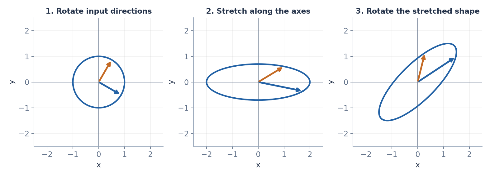

*A two-dimensional demonstration of SVD: apply V transpose, then the axis stretches, then U. The colored arrows track the same two input directions. Orthogonal factors can also include reflections.*

### Building a matrix from simple pieces

The SVD can also be written as a **sum of simple matrices**:

$$
A = \sigma_1\,\mathbf{u}_1\mathbf{v}_1^\top + \sigma_2\,\mathbf{u}_2\mathbf{v}_2^\top + \cdots
$$

Each piece $\mathbf{u}\mathbf{v}^\top$ is a column times a row (an **outer product**). For example:

$$
\begin{bmatrix}1\\2\end{bmatrix}\begin{bmatrix}3 & 4\end{bmatrix} = \begin{bmatrix}3 & 4\\6 & 8\end{bmatrix}
$$

That matrix has rank 1: every row is a multiple of $[3, 4]$. So the SVD writes any matrix as **a sum of rank-1 pieces, ordered from most important (largest $\sigma$) to least important**.

### Why that's useful: keeping only the important pieces

If the first few singular values are big and the rest are tiny, you can **throw away the tiny pieces** and keep a very good approximation:

$$
A \approx \sigma_1\mathbf{u}_1\mathbf{v}_1^\top + \cdots + \sigma_k\mathbf{u}_k\mathbf{v}_k^\top
$$

This is called a **rank-$k$ approximation**, and it's the best possible approximation using that many pieces.

**Example: image compression.** A $1000 \times 1000$ grayscale image is a matrix of 1,000,000 numbers. Keeping 20 pieces needs $20 \times (1000 + 1000 + 1) = 40{,}020$ numbers, about 4% of the original, and often still looks recognizable. Real images have lots of structure, so a few directions capture most of it.

> **Why ML cares:** SVD is how PCA is computed in practice. A popular technique for cheaply customizing large AI models (LoRA) is based on exactly this "a few pieces capture most of it" idea: instead of changing all $1024 \times 1024 = 1{,}048{,}576$ numbers in a matrix, it learns a rank-8 change using only $2 \times 1024 \times 8 = 16{,}384$ numbers.

### Exercises

**19.1.** Calculate the outer product $\begin{bmatrix}2\\-1\\3\end{bmatrix}\begin{bmatrix}1 & 4\end{bmatrix}$. What's its shape and its rank?

**19.2.** A $500 \times 800$ matrix is approximated with $k = 10$ pieces. How many numbers are stored? What fraction of the original is that?

**19.3.** In your own words: what does "every matrix is rotate → stretch → rotate" mean, and what do the singular values tell you?

<details>
<summary>Solutions</summary>

**19.1.** $\begin{bmatrix}2 & 8\\-1 & -4\\3 & 12\end{bmatrix}$. Shape $3 \times 2$, rank 1.

**19.2.** $10 \times (500 + 800 + 1) = 13{,}010$ numbers, out of $400{,}000$, about 3.3%.

**19.3.** Whatever the matrix does to space can be broken into turning it, stretching it along perpendicular axes, and turning it again. The singular values are the stretch amounts, and they show which directions matter most.

</details>

---

## Code lab — `math/03_linear_algebra.py`

### What you're doing and why

**Part A:** write vector and matrix operations with plain loops. That forces you to understand exactly what each operation computes.
**Part B:** use NumPy to *see* the ideas: transformations, similarity search, eigenvectors, and compression.

**Rules:** no AI, no autocomplete, no copying.

### Python you need

- Lists of lists for matrices: `A = [[1, 2], [3, 4]]`, where `A[0][1]` is row 0, column 1 (Python counts from 0).
- `len(A)` = number of rows, and `len(A[0])` = number of columns.
- NumPy: `np.array(...)`, `A @ B` (matrix multiply), `A.T` (transpose), `np.linalg.norm(v)` (length), `np.linalg.eig(A)`, `np.linalg.svd(A)`.
- `np.argsort(values)` gives the positions that would sort the values from smallest to largest.
- `time.time()` gives the current time in seconds, useful for measuring speed.

### The tasks

```python
import numpy as np
import matplotlib.pyplot as plt
import time

# ---- Part A: plain Python only (lists and loops) ----

def dot(a, b):
    """sum of a_i * b_i  (§5)"""
    ...

def length(a):
    """sqrt of sum of a_i^2  (§3). Hint: use your dot()."""
    ...

def cosine_similarity(a, b):
    """(§6)"""
    ...

def mat_vec(A, x):
    """A times vector x, using the row view (§10)."""
    ...

def mat_mul(A, B):
    """Matrix times matrix (§12). Raise ValueError if the shapes don't fit."""
    ...

if __name__ == "__main__":
    assert dot([1, 2, 3], [4, 5, 6]) == 32
    assert length([3, 4]) == 5
    assert abs(cosine_similarity([1, 2, 3], [4, 5, 6]) - 0.9746) < 1e-4
    assert mat_vec([[50, 8, 90], [45, 9, 100]], [2, 12, 1]) == [286, 298]
    assert mat_mul([[1, 2], [3, 4]], [[5, 6], [7, 8]]) == [[19, 22], [43, 50]]
    assert mat_mul([[1, 0, 2], [-1, 3, 1]], [[3, 1], [2, 1], [1, 0]]) == [[5, 1], [4, 2]]

    # ---- Part B: NumPy ----

    # 1) Speed: make two random 200x200 matrices. Time your mat_mul vs A @ B.
    #    How many times faster is NumPy?

    # 2) "A matrix is a transformation" (§11):
    #    Draw the square with corners (0,0), (1,0), (1,1), (0,1) and the arrows [1,0], [0,1].
    #    Apply the shear [[1,1],[0,1]] and a 30-degree rotation. Plot before and after, side by side.
    #    Check: do the arrows land on the matrix columns?

    # 3) Similarity search (§6):
    #    Make 10,000 random vectors with 50 components (np.random.randn(10000, 50)).
    #    Make one random "query" vector. Normalize everything to length 1.
    #    Find the 5 most similar by cosine, by dot product, and by smallest distance.
    #    Check that all three give the same 5. Then repeat WITHOUT normalizing. Do they still agree?

    # 4) Eigenvectors (§18):
    #    For A = [[2, 1], [1, 2]], use np.linalg.eig. Check A @ v equals lambda * v for each pair.

    # 5) SVD compression (§19):
    #    Load any grayscale image as a 2-D array (or make one: plt.imread on a photo, then average the color channels).
    #    Rebuild it with k = 5, 20, 50 pieces and plot all three next to the original.
    #    Print what fraction of numbers each version stores.
    print("all checks passed")
```

Before part 3, **predict** whether unnormalized vectors will give the same top 5.

<details>
<summary>Reference solution for Part A (only after your own attempt)</summary>

```python
def dot(a, b):
    total = 0
    for i in range(len(a)):
        total += a[i] * b[i]
    return total

def length(a):
    return dot(a, a) ** 0.5

def cosine_similarity(a, b):
    return dot(a, b) / (length(a) * length(b))

def mat_vec(A, x):
    return [dot(row, x) for row in A]

def mat_mul(A, B):
    rows_A, cols_A = len(A), len(A[0])
    rows_B, cols_B = len(B), len(B[0])
    if cols_A != rows_B:
        raise ValueError(f"can't multiply {rows_A}x{cols_A} by {rows_B}x{cols_B}")
    result = []
    for i in range(rows_A):
        row = []
        for j in range(cols_B):
            column_j = [B[k][j] for k in range(rows_B)]
            row.append(dot(A[i], column_j))
        result.append(row)
    return result
```

</details>

<details>
<summary>Reference solution for Part B, task 3 (only after your own attempt)</summary>

```python
docs = np.random.randn(10000, 50)
query = np.random.randn(50)
docs_n = docs / np.linalg.norm(docs, axis=1, keepdims=True)
query_n = query / np.linalg.norm(query)

by_cosine = np.argsort(-(docs_n @ query_n))[:5]
by_dot = np.argsort(-(docs_n @ query_n))[:5]
by_distance = np.argsort(np.linalg.norm(docs_n - query_n, axis=1))[:5]
print(by_cosine, by_dot, by_distance)
```

(`axis=1` means "do this for each row separately," and `keepdims=True` keeps the shape so the division lines up row by row.)

</details>

---

## Common mistakes

| Mistake | Why it's wrong |
|---|---|
| Thinking the dot product gives a vector | It gives a single number |
| Reading $3 \times 2$ as 3 columns, 2 rows | Rows always come first: 3 rows, 2 columns |
| Assuming $AB = BA$ | Order matters: §12 has an example where they differ |
| Multiplying matrices entry by entry | That's the Hadamard product $\odot$, a different operation |
| Using `*` instead of `@` in NumPy | `*` is entry by entry |
| Reading $A^{-1}$ as "1 over each entry" | It's the matrix that undoes $A$ |
| Reading $A^\top$ as a power | It's the transpose (flip rows and columns) |
| Forgetting that $(AB)^\top = B^\top A^\top$ reverses the order | Check with numbers in §13 |
| Confusing bold $\mathbf{e}_1$ with the number $e$ | $\mathbf{e}_1 = [1, 0]$ is a basis vector |
| Confusing $\Sigma$ in SVD with the sum sign | Same Greek letter, different meaning. Context tells you which |
| Trying to invert a matrix with determinant 0 | No inverse exists |

---

## Check yourself

Do this **after** working through the file. Closed book, 20 minutes.

1. $\mathbf{a} = [1, 2, 3]$, $\mathbf{b} = [4, 5, 6]$. Calculate $\mathbf{a} \cdot \mathbf{b}$ and $\lVert \mathbf{a} \rVert$.
2. Calculate the cosine similarity of $\mathbf{a}$ and $\mathbf{b}$.
3. $A$ is $3 \times 2$ and $B$ is $2 \times 4$. What's the shape of $AB$? Is $BA$ defined?
4. Calculate $\begin{bmatrix}1 & 2\\3 & 4\end{bmatrix}\begin{bmatrix}5 & 6\\7 & 8\end{bmatrix}$.
5. What is $(AB)^\top$ in terms of $A^\top$ and $B^\top$?
6. Calculate $\det\begin{bmatrix}2 & 1\\4 & 2\end{bmatrix}$. Is it invertible? What's its rank?
7. What does $\begin{bmatrix}0 & -1\\1 & 0\end{bmatrix}$ do to $[1, 0]$? Describe it as a transformation.
8. Find the eigenvalues of $\begin{bmatrix}2 & 1\\1 & 2\end{bmatrix}$.
9. $X$ is $1000 \times 10$ and $\mathbf{w}$ has 10 entries. What's the shape of $X\mathbf{w}$? Explain it using the column view.
10. Project $[3, 4]$ onto $[1, 1]$.
11. Explain in one sentence what span and linear independence mean.
12. Explain "a matrix is a transformation" using the idea of where basis vectors land.

<details>
<summary>Answers</summary>

**1.** $\mathbf{a} \cdot \mathbf{b}$ and $\lVert \mathbf{a} \rVert$ for $\mathbf{a} = [1,2,3]$, $\mathbf{b} = [4,5,6]$ → §3, §5

*Dot product* — multiply matching entries, then add them all:

$$\mathbf{a} \cdot \mathbf{b} = (1)(4) + (2)(5) + (3)(6) = 4 + 10 + 18 = 32$$

*Length* — Pythagoras in $n$ dimensions: square every entry, add, take the root:

$$\lVert \mathbf{a} \rVert = \sqrt{1^2 + 2^2 + 3^2} = \sqrt{1 + 4 + 9} = \sqrt{14} \approx 3.742$$

*Sanity check on the length:* the longest entry is 3, so the arrow must be at least 3 long, and at most $1+2+3 = 6$. $3.742$ sits in that window ✓

---

**2.** Cosine similarity of $\mathbf{a}$ and $\mathbf{b}$ → §6

Cosine similarity is the dot product with both lengths divided out, which strips away magnitude and leaves only direction:

$$\cos\theta = \frac{\mathbf{a} \cdot \mathbf{b}}{\lVert \mathbf{a} \rVert \lVert \mathbf{b} \rVert}$$

*Step 1 — the pieces.* From Q1, $\mathbf{a} \cdot \mathbf{b} = 32$ and $\lVert \mathbf{a} \rVert = \sqrt{14}$. And:

$$\lVert \mathbf{b} \rVert = \sqrt{16 + 25 + 36} = \sqrt{77} \approx 8.775$$

*Step 2 — divide:*

$$\cos\theta = \frac{32}{\sqrt{14}\sqrt{77}} = \frac{32}{\sqrt{1078}} \approx \frac{32}{32.833} \approx 0.975$$

*Reading it:* cosine similarity lives in $[-1, 1]$. $0.975$ is very close to 1, so these two vectors point in nearly the same direction, even though $\mathbf{b}$ is more than twice as long. That length-blindness is the whole reason cosine similarity is used for comparing embeddings.

---

**3.** $A$ is $3 \times 2$, $B$ is $2 \times 4$: shape of $AB$? Is $BA$ defined? → §12

The shape rule: write the shapes side by side, and the **inner** numbers must match. The **outer** numbers give the result.

*For $AB$:*

$$(3 \times \underbrace{2) \cdot (2}_{\text{match ✓}} \times 4) \;\longrightarrow\; 3 \times 4$$

*For $BA$:*

$$(2 \times \underbrace{4) \cdot (3}_{4 \ne 3 \text{ ✗}} \times 2)$$

Not defined. $4 \ne 3$.

*Why the rule exists:* each entry of the product is a dot product between a row of the left matrix and a column of the right one. A row of $B$ has 4 entries, a column of $A$ has 3 — you can't dot a 4-list with a 3-list, there's nothing to pair the leftovers with.

This is also the everyday proof that $AB \ne BA$: often one of them doesn't even exist.

---

**4.** $\begin{bmatrix}1 & 2\\3 & 4\end{bmatrix}\begin{bmatrix}5 & 6\\7 & 8\end{bmatrix}$ → §12

Entry $(i, j)$ of the answer is row $i$ of the left matrix dotted with column $j$ of the right one.

*Top-left* — row 1 with column 1: $(1)(5) + (2)(7) = 5 + 14 = 19$

*Top-right* — row 1 with column 2: $(1)(6) + (2)(8) = 6 + 16 = 22$

*Bottom-left* — row 2 with column 1: $(3)(5) + (4)(7) = 15 + 28 = 43$

*Bottom-right* — row 2 with column 2: $(3)(6) + (4)(8) = 18 + 32 = 50$

$$\begin{bmatrix}19 & 22\\43 & 50\end{bmatrix}$$

---

**5.** $(AB)^\top$ in terms of $A^\top$ and $B^\top$ → §13

$$(AB)^\top = B^\top A^\top$$

The order **reverses**.

*Why, by shapes:* if $A$ is $m \times n$ and $B$ is $n \times p$, then $AB$ is $m \times p$, so $(AB)^\top$ is $p \times m$. Now $A^\top$ is $n \times m$ and $B^\top$ is $p \times n$. The only order that even fits is $B^\top A^\top$: $(p \times n)(n \times m) = p \times m$ ✓ Writing $A^\top B^\top$ would need $m = p$, which usually isn't true.

*The everyday analogy:* undoing "socks then shoes" is "shoes off then socks off." Reversing a sequence of operations reverses their order.

---

**6.** $\det\begin{bmatrix}2 & 1\\4 & 2\end{bmatrix}$, invertible? rank? → §14, §15, §16

*Determinant* — for a $2\times2$, it's $ad - bc$:

$$\det = (2)(2) - (1)(4) = 4 - 4 = 0$$

*Invertible?* No. A zero determinant means the matrix is not invertible (singular). The determinant measures how much area the transformation scales by, and $0$ means it squashes the whole plane flat onto a line. Once that information is destroyed, nothing can undo it.

*Rank* — the number of genuinely independent directions in the output. The columns are $[2, 4]$ and $[1, 2]$, and the first is exactly $2 \times$ the second. They point along the same line, so together they span only a 1-dimensional space. **Rank 1.** (The rows say the same thing: $[4, 2] = 2 \times [2, 1]$.)

The three answers are one fact in three languages: determinant 0 = not invertible = rank less than full.

---

**7.** What does $\begin{bmatrix}0 & -1\\1 & 0\end{bmatrix}$ do to $[1, 0]$? → §11

*Compute it* — row by column:

$$\begin{bmatrix}0 & -1\\1 & 0\end{bmatrix}\begin{bmatrix}1\\0\end{bmatrix} = \begin{bmatrix}(0)(1) + (-1)(0)\\(1)(1) + (0)(0)\end{bmatrix} = \begin{bmatrix}0\\1\end{bmatrix}$$

*Name the transformation:* $[1, 0]$ points right (east), and it landed on $[0, 1]$, which points up (north). East → north is a **90° counterclockwise rotation**.

*Confirm with the other basis vector:* the columns of a matrix are exactly where the basis vectors land. Column 2 is $[-1, 0]$, so $[0, 1]$ (north) goes to $[-1, 0]$ (west). North → west is also 90° counterclockwise ✓ Both agree, so the whole plane rotates.

---

**8.** Eigenvalues of $\begin{bmatrix}2 & 1\\1 & 2\end{bmatrix}$ → §18

Eigenvalues are the numbers $\lambda$ for which $A\mathbf{v} = \lambda\mathbf{v}$ has a nonzero solution — directions the matrix only stretches, never turns. Find them by solving $\det(A - \lambda I) = 0$.

*Step 1 — subtract $\lambda$ down the diagonal:*

$$A - \lambda I = \begin{bmatrix}2 - \lambda & 1\\1 & 2 - \lambda\end{bmatrix}$$

*Step 2 — set the determinant to zero:*

$$(2 - \lambda)(2 - \lambda) - (1)(1) = 0 \quad\Rightarrow\quad (2 - \lambda)^2 = 1$$

*Step 3 — take the square root of both sides,* remembering **both** signs:

$$2 - \lambda = \pm 1 \quad\Rightarrow\quad \lambda = 2 - 1 = 1 \quad\text{or}\quad \lambda = 2 + 1 = 3$$

Eigenvalues: $1$ and $3$.

*Check without redoing the work:* eigenvalues must sum to the trace (the diagonal sum, $2 + 2 = 4$) and multiply to the determinant ($4 - 1 = 3$). Indeed $1 + 3 = 4$ ✓ and $1 \times 3 = 3$ ✓

---

**9.** $X$ is $1000 \times 10$, $\mathbf{w}$ has 10 entries: shape of $X\mathbf{w}$? → §10

*Shape:* treat $\mathbf{w}$ as $10 \times 1$. Then $(1000 \times 10)(10 \times 1) \rightarrow 1000 \times 1$. **1000 entries.**

*Row view (the concrete reading):* each row of $X$ is one data point with 10 features. Dotting it with $\mathbf{w}$ gives that point's single prediction. 1000 rows in, 1000 predictions out.

*Column view (the one asked for):* $X\mathbf{w}$ is a **linear combination of the columns of $X$**, with the entries of $\mathbf{w}$ as the mixing amounts:

$$X\mathbf{w} = w_1 \cdot (\text{column }1) + w_2 \cdot (\text{column }2) + \cdots + w_{10} \cdot (\text{column }10)$$

Each column is one feature measured across all 1000 examples. So the prediction vector is the 10 feature-columns blended together, and $w_j$ is how much feature $j$ counts. Training a linear model = searching for the blend that lands closest to the targets.

---

**10.** Project $[3, 4]$ onto $[1, 1]$ → §7

Projection answers: how much of $\mathbf{a}$ points along $\mathbf{b}$, expressed as a vector on $\mathbf{b}$'s line?

$$\text{proj}_{\mathbf{b}}\mathbf{a} = \frac{\mathbf{a} \cdot \mathbf{b}}{\mathbf{b} \cdot \mathbf{b}}\,\mathbf{b}$$

*Step 1 — top:* $\mathbf{a} \cdot \mathbf{b} = (3)(1) + (4)(1) = 7$

*Step 2 — bottom:* $\mathbf{b} \cdot \mathbf{b} = 1 + 1 = 2$ (the squared length of $\mathbf{b}$)

*Step 3 — scale $\mathbf{b}$ by that fraction:*

$$\frac{7}{2}[1, 1] = [3.5,\, 3.5]$$

*Check the defining property:* the leftover $\mathbf{a} - \text{proj} = [3 - 3.5,\ 4 - 3.5] = [-0.5,\ 0.5]$ must be perpendicular to $\mathbf{b}$. Dot it: $(-0.5)(1) + (0.5)(1) = 0$ ✓ Perpendicular, which is exactly the condition the formula was derived from.

---

**11.** Span and linear independence in one sentence each → §8

**Span:** every point you can reach by scaling the vectors and adding them together — everything mixable from what you've got.

**Linear independence:** no vector in the set is a mix of the others, so each one contributes a genuinely new direction, and dropping any of them shrinks the span.

*With numbers:* $[1, 0]$ and $[0, 1]$ are independent and span the whole plane. $[1, 0]$ and $[2, 0]$ are dependent (the second is just $2\times$ the first), so together they span only the horizontal line — the second adds nothing.

---

**12.** "A matrix is a transformation," explained through basis vectors → §11

Feed the basis vector $[1, 0]$ to a $2\times2$ matrix and you get back its first column, exactly. Feed it $[0, 1]$ and you get its second column. So **a matrix is literally a record of where the basis vectors land** — nothing more.

Every other vector follows automatically, because every vector is a mix of the basis vectors, and the transformation preserves mixing:

$$\begin{bmatrix}x\\y\end{bmatrix} = x\begin{bmatrix}1\\0\end{bmatrix} + y\begin{bmatrix}0\\1\end{bmatrix} \quad\Rightarrow\quad A\begin{bmatrix}x\\y\end{bmatrix} = x(\text{col }1) + y(\text{col }2)$$

*The consequence:* to write down the matrix for any transformation — a rotation, a stretch, a reflection, a shear — you never need a formula. Just ask where $[1,0]$ goes, where $[0,1]$ goes, and stack those two answers as columns.

</details>

---

## Definition of Done

Tick a box only when it's honestly true **without looking at this file**.

- [ ] I can explain what a vector is as both a list and an arrow, and read $\mathbb{R}^n$ notation.
- [ ] I can add, scale, and subtract vectors, and draw each operation.
- [ ] I can compute length, distance, and normalize a vector, and explain where the length formula comes from.
- [ ] I can explain cosine using the unit circle, and state the values at $0°$, $90°$, and $180°$.
- [ ] I can compute a dot product, explain both of its meanings, and explain why they agree.
- [ ] I can compute cosine similarity and explain when it disagrees with the dot product.
- [ ] I can derive the projection formula from the perpendicular condition.
- [ ] I can explain linear combination, span, independence, basis, and dimension with 2D examples.
- [ ] I can multiply a matrix by a vector using both the row view and the column view.
- [ ] I can explain a matrix as a transformation, write the matrix for a stretch, reflection, shear, or rotation, and explain why its columns are what they are.
- [ ] I can multiply matrices by hand, apply the shape rule instantly, and explain why $AB \ne BA$.
- [ ] I can compute a transpose and explain why $(AB)^\top = B^\top A^\top$.
- [ ] I can compute a $2 \times 2$ determinant and inverse, and explain what determinant 0 means geometrically.
- [ ] I can explain rank, and the three outcomes for a system of equations.
- [ ] I can derive the normal equations from perpendicularity, and use them to fit a line.
- [ ] I can find eigenvalues and eigenvectors of a $2 \times 2$ matrix and explain what they mean as a picture.
- [ ] I can explain SVD as rotate → stretch → rotate, and what a low-rank approximation saves.
- [ ] Check yourself: 12/12.
- [ ] Code lab done without AI.

---

## Symbol cheat sheet

| Symbol | Read it aloud as | Meaning | Section |
|---|---|---|---|
| $\mathbf{v}$ | "vector v" | a list of numbers (bold = vector) | §1 |
| $v_i$ | "v sub i" | component $i$ of $\mathbf{v}$ | §1 |
| $\mathbb{R}^n$ | "R n" | all vectors with $n$ real components | §1 |
| $\mathbf{0}$ | "the zero vector" | all components zero | §1 |
| $\lVert \mathbf{v} \rVert$ | "length of v" or "norm of v" | $\sqrt{\sum v_i^2}$ | §3 |
| $\lVert \mathbf{v} \rVert_1$ | "L1 norm of v" | $\sum \lvert v_i \rvert$ | §3 |
| $\hat{\mathbf{v}}$ | "v hat" | unit vector in the direction of $\mathbf{v}$ | §3 |
| $\theta$ | "theta" | an angle | §4 |
| $\cos\theta$, $\sin\theta$ | "cosine theta," "sine theta" | horizontal and vertical position on the unit circle | §4 |
| $\mathbf{a} \cdot \mathbf{b}$ | "a dot b" | dot product: $\sum a_i b_i$ | §5 |
| $⟺$ | "if and only if" | each statement implies the other | §6 |
| $\text{proj}_{\mathbf{a}}(\mathbf{b})$ | "projection of b onto a" | shadow of $\mathbf{b}$ on $\mathbf{a}$'s line | §7 |
| $\text{span}\{\ldots\}$ | "span of" | all linear combinations | §8 |
| $\mathbf{e}_1, \mathbf{e}_2$ | "e one, e two" | standard basis vectors $[1, 0]$, $[0, 1]$ | §8 |
| $A$ | "matrix A" | grid of numbers (capital = matrix) | §9 |
| $m \times n$ | "m by n" | $m$ rows, $n$ columns | §9 |
| $A_{ij}$ | "A i j" | entry in row $i$, column $j$ | §9 |
| $I$ | "the identity" | diagonal of 1s; does nothing | §9 |
| $\longmapsto$ | "maps to" | input goes to output | §11 |
| $AB$ | "A times B" | matrix product: do $B$ first, then $A$ | §12 |
| $A \odot B$ | "Hadamard product" | entry-by-entry product | §12 |
| $A^\top$ | "A transpose" | rows become columns | §13 |
| $\det(A)$ | "determinant of A" | area/volume scaling factor | §14 |
| $A^{-1}$ | "A inverse" | the matrix that undoes $A$ | §15 |
| $\lambda$ | "lambda" | an eigenvalue | §18 |
| $U\Sigma V^\top$ | "U sigma V transpose" | the SVD pieces | §19 |
| $\sigma_i$ | "sigma i" | a singular value | §19 |

---

## Resources (only if stuck)

1. **Best for intuition:** [3Blue1Brown — Essence of Linear Algebra](https://www.3blue1brown.com/topics/linear-algebra). The animations show everything in this file as moving pictures. Watch the video matching the section you're stuck on: *Vectors* (§1–2), *Linear combinations, span, and basis vectors* (§8), *Linear transformations and matrices* (§10–11), *Matrix multiplication as composition* (§12), *The determinant* (§14), *Inverse matrices, column space and null space* (§15–16), *Dot products and duality* (§5), *Eigenvectors and eigenvalues* (§18).
2. **Extra practice:** [Khan Academy — Linear Algebra](https://www.khanacademy.org/math/linear-algebra), for more exercises on any section.
